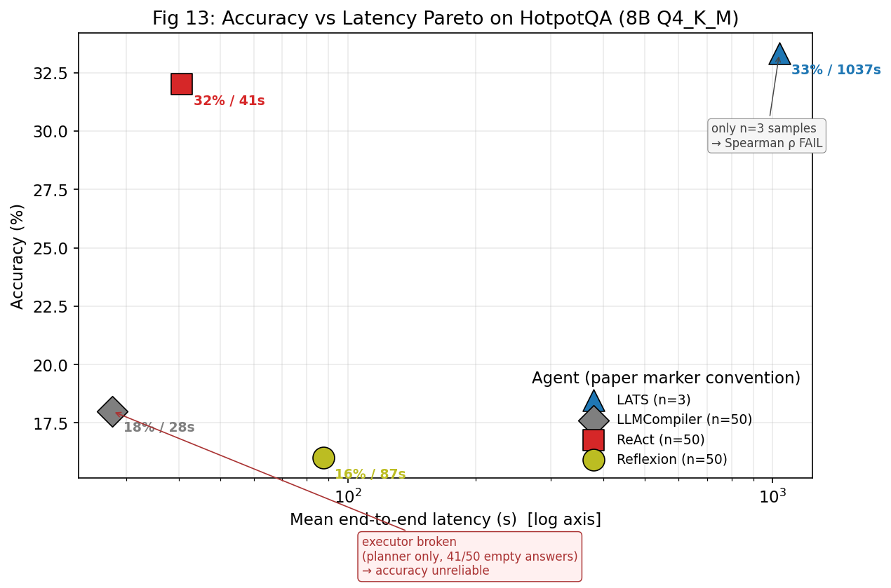
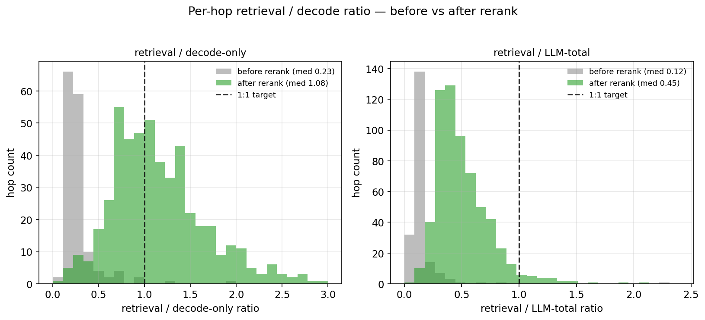
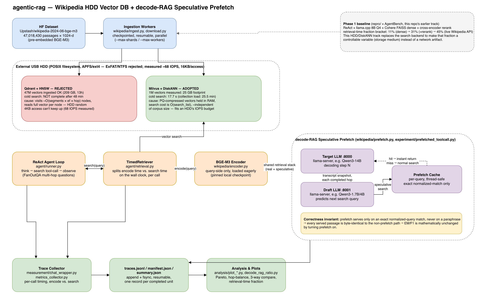

# agentic-rag — decode-RAG의 검색 지연을 "저장매체"라는 독립변수로 통제해 재현 가능하게 측정하는 연구

KAIST **"The Cost of Dynamic Reasoning: Demystifying AI Agents and Test-Time Scaling from an AI Infrastructure Perspective"** (arXiv [2506.04301v2](https://arxiv.org/abs/2506.04301), HPCA-2026)의 HotpotQA 실험을 로컬 Apple Silicon에서 재현하고, 그 위에서 검색 백엔드를 **Live Wikipedia API → Cohere 벡터DB(+rerank) → 외장 USB HDD 위 Milvus DiskANN**까지 단계적으로 바꿔가며 "에이전트가 검색을 기다리며 노는 시간(retrieval-time fraction)을 decode 뒤로 얼마나 숨길 수 있는가"(decode-RAG speculative prefetch)를 정량화하는 **학부 졸업 프로젝트**입니다. **아직 진행 중인 연구**입니다.

> *A from-scratch local reproduction of a HPCA-2026 AI-infrastructure paper, extended into an original decode-RAG speculative-prefetch study where the retrieval backend's storage medium — network API, SSD-backed vector DB, external HDD with a DiskANN index — is treated as a controlled experimental variable, not an implementation detail.*

[](https://www.python.org/)
[](https://github.com/ggml-org/llama.cpp)
[](https://www.langchain.com/langgraph)
[](https://cohere.com/)
[](https://qdrant.tech/)
[](https://milvus.io/)
[](https://pytorch.org/)
[](https://docs.astral.sh/uv/)
[](#7-getting-started)
[](#9-실험-연구-정리-experiment-branch-audit)

**목차**: [1. Overview](#1-overview--배경--동기) · [2. Demo](#2-demo) · [3. Architecture](#3-architecture) · [4. My Role](#4-my-role) · [5. Key Results](#5-key-results) · [6. Tech Stack Rationale](#6-tech-stack-rationale) · [7. Getting Started](#7-getting-started) · [8. Links](#8-links) · [9. 실험 연구 정리](#9-실험-연구-정리-experiment-branch-audit)

---

## 1. Overview — 배경 / 동기

- AI 에이전트(ReAct 등)는 `생각 → 검색 → 관찰`을 반복하는데, **검색을 기다리는 동안 GPU가 절반 가까이 논다**(논문 실측: ReAct-HotpotQA GPU idle **54.5%**).
- 이 idle 구간은 단일 요청 안에서 LLM↔도구가 순차 의존하기 때문에 생기는 비효율이며, **decode 중 다음 retrieval을 미리 당겨와(prefetch/overlap) 숨길 수 있는 대상**이다. 이것이 이 저장소가 다루는 "decode-RAG" 문제다.
- 그런데 "검색이 얼마나 숨겨질 수 있는가"는 검색이 얼마나 느린가에 달려 있고, 검색 지연은 결국 **벡터를 어디서, 어떤 자료구조로 읽어오는가**(저장매체)에 달려 있다. 이 repo는 그 저장매체를 네트워크 API → 로컬 SSD 벡터DB → 외장 HDD로 단계적으로 바꿔가며 **retrieval-time fraction을 재현 가능한 독립변수로 통제**한다.
- 본 repo는 두 가지를 한다 — ① 논문 패턴을 로컬에서 재현하고, ② 그 위에서 decode-RAG baseline(`retrieval-time fraction`)을 재현 가능하게 측정 → 저장매체를 HDD로 밀어붙여 처치 강도를 키우고 → speculative prefetch로 실제로 숨겨본다.

**환경 격차상 절대 수치(초·Wh)는 비교 불가** → **비율·분포·순위·트레이드오프 형상**의 재현을 목표로 한다.

| | 논문 | 본 재현 |
|---|---|---|
| GPU | NVIDIA A100 (GCP) | Apple M3 Pro 36GB (Metal) |
| Backend | vLLM 0.6.6 · FP16 | llama.cpp · Q4_K_M GGUF |
| 모델 | Llama-3.1 8B/70B | Llama-3.1-8B-Instruct Q4_K_M |
| 벤치 | HotpotQA·WebShop·MATH·HumanEval | HotpotQA (decode-RAG에 가장 적합) |

---

## 2. Demo

이 프로젝트는 사용자 대면 UI가 없는 **인프라/측정 연구**이므로, "데모"는 실제로 생성한 결과 리포트와 그래프로 대신합니다. 모두 이 저장소에 포함되어 있고 직접 열어볼 수 있습니다.

| 산출물 | 내용 |
|---|---|
| [`three_way_compare.html`](three_way_compare.html) | 논문 vs Live-Wiki 1차 재현 vs 현재 Cohere VDB+rerank, 6개 지표 3자 비교 (메인 결과 리포트) |
| [`progress_report.html`](progress_report.html) | 재현 진행 상황 요약 리포트 |
| [`presentation.html`](presentation.html) / [`presentation_script.md`](presentation_script.md) | 재현 발표 덱 + 대본 |
| [`hdd_prefetch_report.html`](hdd_prefetch_report.html) | 외장 HDD 벡터DB + prefetch 메커니즘 리포트 |

아래는 `repro/analysis/`가 실제 실험 로그(`results/raw/*.jsonl`)로부터 생성한 그래프 2장입니다.

**Fig 13 — 4개 에이전트(ReAct/Reflexion/LATS/LLMCompiler) 정확도-지연 Pareto (실측, n=50/에이전트)**



**hop별 `retrieval/decode` 비율 — rerank 적용 전후 (실측)**

rerank를 추가하기 전에는 검색이 decode보다 훨씬 짧아(중앙값 0.23) 숨길 시간 자체가 부족했고, rerank 추가 후에는 중앙값이 1.08로 올라가 "검색 1회 ≈ decode 1스텝"에 가까워졌다 — 이게 바로 decode-RAG prefetch가 성립하기 위한 전제 조건이다.



---

## 3. Architecture

이 저장소는 4개의 층으로 구성됩니다 — **(ingestion)** Wikipedia 임베딩을 벡터DB에 적재 → **(storage)** 두 백엔드(Qdrant HNSW / Milvus DiskANN)를 같은 외장 HDD 위에서 비교 → **(agent)** ReAct 에이전트가 `search` 툴콜로 검색 → **(prefetch)** 보조(draft) LLM이 다음 검색어를 미리 예측해 캐시를 채우는 decode-RAG 메커니즘 → 전 과정이 **(measurement)** 트레이스로 남아 분석·플롯으로 이어집니다.



*(다이어그램 원본: [`docs/architecture/architecture.svg`](docs/architecture/architecture.svg), draw.io로 직접 제작 — 코드베이스(`agent/`, `wikipedia/`, `experiment/`, `repro/measurement`)를 분석해 그렸습니다.)*

핵심 설계 포인트 3가지 (자세한 배경은 [§6 Tech Stack Rationale](#6-tech-stack-rationale)와 [§9 실험 연구 정리](#9-실험-연구-정리-experiment-branch-audit) 참고):

1. **Qdrant HNSW는 HDD에서 기각됐다.** 47M 벡터를 209GB로 적재하는 것까지는 성공했지만, 콜드 검색 1회가 48분 타임아웃에도 끝나지 않았다 — HNSW가 방문 노드마다 전체 벡터를 읽는 자료구조이기 때문. **Milvus DiskANN**(PQ 압축 그래프를 램에 두고 탐색)으로 피벗해 콜드 검색 17.7초를 실측했다.
2. **decode-RAG prefetch는 정확도를 절대 바꾸지 않는다.** draft LLM이 예측한 다음 검색어가 실제 검색어와 **정규화 후 정확히 일치할 때만** 캐시를 사용한다. 불일치 시 기존 경로 그대로 실행되므로, 반환되는 passage는 baseline과 항상 byte-identical → EM/F1이 수학적으로 불변이다.
3. **모든 호출은 타이밍이 남는다.** `TimedRetriever`가 encode 시간과 search 시간을 분리해서 재고, `measurement/`가 이를 append+fsync JSONL로 기록해 중단·재개가 가능하다 — 13시간짜리 적재, 3시간짜리 컬렉션 로드처럼 오래 걸리는 실험을 다루기 위한 필수 설계다.

저장소 구조:

```
agentic_rag/
├── README.md                     # (이 문서)
├── docs/architecture/            # 아키텍처 다이어그램 (이번 정리에서 추가)
├── 2506.04301v2.pdf              # 원본 논문
├── paper_analysis.md             # 논문 전체 분석 (한국어)
├── experiment_methodology.md     # 실험 설계·측정 프로토콜
├── presentation.html / .md       # 재현 발표 덱 + 대본
├── three_way_compare.html        # 논문 vs 1차 vs 현재 3자 비교 (메인 결과)
├── agent/                        # ReAct 에이전트 루프 + TimedRetriever (FanOutQA용, 로컬 실험 트랙)
├── wikipedia/                    # Upstash Wikipedia 벡터DB workspace — Qdrant/Milvus 적재·검색·prefetch
│   └── src/wikipedia/            # ingest.py, milvus.py, qdrant.py, prefetch.py, encoder.py …
├── experiment/                   # 로컬 측정 CLI (parallel/tooluse/prefetched-toolcall/vectordb …)
├── fanoutqa/                     # FanOutQA 데이터셋 로더
├── AgentBench/                   # (third-party, 별도 clone 필요) ReAct/Reflexion/LATS/LLMCompiler
└── repro/                        # 논문 재현 인프라
    ├── setup/                    # llama.cpp 빌드·모델 다운로드·서버 기동
    ├── retrieval/                # Cohere 벡터DB 인덱스 빌더
    ├── sweep/                    # 실험 오케스트레이션
    ├── measurement/               # trace 스키마·콜백·EM/F1 채점
    ├── analysis/                  # plot_fig*.py + 3자비교·hop balance·decode-rag 분석
    ├── experiments/                # 트랙별 설계 문서 (decode_rag_prefetch/, react_vectordb/, wikipedia_hdd/)
    └── tests/                     # pytest
```

---

## 4. My Role

이 저장소는 **학부 졸업 프로젝트(2인 팀)**이며, **아직 진행 중**입니다. 팀원은 함께 졸업 프로젝트를 진행하는 **Cheolwan Park**으로, 하드웨어 쪽에 강해 실험 설계 상당 부분을 주도했습니다. 전체 97개 커밋 중 84개(약 87%)가 본인(임동현)의 작업이며, 나머지 13개는 Cheolwan Park이 기여했습니다 — 다만 커밋 수는 코드 구현 비중만 반영할 뿐, 실험을 어떻게 설계할지에 대한 논의와 의사결정은 함께 이뤄졌습니다.

- **본인이 직접 수행한 것**: 논문 재현 설계·실행(HotpotQA, 4종 에이전트, Fig4/6/7/8/13 검증), Cohere 벡터DB baseline 구축과 rerank 도입 의사결정, **외장 HDD 위 Milvus DiskANN 트랙 전체**(Qdrant HNSW 47M 적재 → 48분 검색 실패 진단 → DiskANN 피벗 → 10M 컬렉션 로드/etcd/Docker 파일공유 인프라 디버깅, 30개 커밋), decode-RAG speculative prefetch 메커니즘 구현과 정확성 불변 검증, 전체 분석·플롯·리포트 작성, 그리고 이번 포트폴리오 정리(README/아키텍처 다이어그램/실험 브랜치 감사).
- **Cheolwan Park이 기여한 것**: 하드웨어/인프라 관점에서 실험 설계를 주도(측정 방법론, 코스케줄링 실험 방향 등), Wikipedia 벡터DB workspace의 초기 골격(다운로드·적재 파이프라인 통합, Qdrant 병렬 적재), `experiment/` 로컬 측정 스위트(FanOutQA 트레이스, parallel/tooluse/prefetched-toolcall 실험 5종)의 최초 구현, 그리고 아직 미병합 상태인 `agent/scheduling/` 네이티브 듀얼모델 코스케줄러(§9 참고).

즉 벡터DB 적재·측정 하네스의 **토대**와 **실험 설계**는 공동 작업이었고(특히 하드웨어/코스케줄링 관련 설계는 Cheolwan Park이 주도), 그 위에서 진행된 **저장매체 실험(HDD/DiskANN) 구현과 decode-RAG prefetch 연구, 논문 재현 실행**은 본인이 설계·실행했습니다. 프로젝트는 계속 진행 중이며, 위 실험/구현 범위는 현재까지의 스냅샷입니다.

---

## 5. Key Results

### (A) 논문 재현 — 패턴 수준 일치

| Figure | 검증 | 결과 |
|---|---|---|
| Fig 6 GPU idle (ReAct) | ≈ 54.5% | **54.98%** (Δ0.48%p) ✅ |
| Fig 4 LLM 호출 폭증 (LATS/ReAct) | ≥ 5× | 21.9× ✅ |
| Fig 7 heavy tail (p95/p50) | ≥ 2.0 | 3.34 ✅ |
| Fig 13 Pareto | 형상 | LATS 최정확·최고비용, LLMCompiler 최속 ✅(부분) |
| Fig 13 Spearman ρ | ≥ 0.6 | 0.40 (LATS n=3 한계) ⚠️ |
| Fig 8 tool tokens | ≥ 10% | 0% (handler 한계) ❌ |

### (B) decode-RAG baseline — 검색 백엔드를 Live Wikipedia → Cohere 밀집 벡터DB(+rerank)로 교체해 재현 가능하게 측정

`retrieval-time fraction`을 두 끝점으로 **bracket**:
- Live Wikipedia ReAct: **~45%** (상한, 비재현 — 라이브 API 드리프트)
- Cohere VDB dense-only: **~11%** (하한, 재현 가능 — 검색이 너무 빠름)
- Cohere VDB **+ rerank**: **~31%** (재현 가능, 논문 tool share 30%대와 일치)

**3자 비교(논문 vs 1차 Live Wiki vs 현재 VDB+rerank)** — [`three_way_compare.html`](three_way_compare.html):

| 지표 | 논문 | 1차 (n=50) | 현재 rerank (n=139) |
|---|---|---|---|
| ① tool/e2e | 30.2%* | 44.8% | 31.3% |
| ② LLM / tool | 69 / 30* | 55 / 45 | 68 / 31 |
| ③ calls/q (LLM·tool) | 9.2×* | 8.84·8.54 | 5.67·5.50 |
| ④ EM / F1 | ~25–30% EM* | 32.0 / 38.5 | 30.9 / 41.9 |
| ⑤ p95/p50 | — | 3.15× | 4.66× |
| ⑥ prefill/decode | 4.7 / 74* | 26 / 74 | 39 / 61 |

\* 논문값은 5종 에이전트·4벤치 평균(ReAct-HotpotQA 단독 아님). 정확도는 EM(논문 지표); F1은 본 재현이 보완 추가.

**hop별 retrieval≈decode 균형**: rerank로 hop별 `retrieval/decode-only` 중앙값 **0.23 → 1.08**(≈1:1) — 검색을 decode 뒤에 거의 다 숨길 수 있는 상태 (그래프는 [§2 Demo](#2-demo) 참고).

> ⚠️ **알려진 제약**: 전체 7,405문항 rerank 런은 Cohere **trial 키 월 1,000회 한도**(계정 단위)로 **139/7,405에서 일시 중단**된 상태다. production 키로 교체 후 `sweep/run_vectordb_full.sh` 재실행 시 이어서 완주(진도 보존).

### (C) 외장 HDD 저장매체 실험 (실측)

| 백엔드 | 규모 | 콜드 검색 | 판정 |
|---|---|---|---|
| Qdrant + HNSW | 47M 벡터, 209GB | **48분 타임아웃에도 미완료** | 기각 — HDD 랜덤 IOPS(68 IOPS 실측)와 그래프 탐색 패턴 불일치 |
| Milvus + DiskANN | 1M 벡터, 25GB | **17.7초** (컬렉션 로드 25.5분) | 채택 — PQ 압축 벡터를 램에 두고 탐색해 코퍼스 크기에 거의 무관 |

10M 규모 DiskANN 로드는 진행 중이며 etcd 리스 상실·Docker 파일공유(virtiofs/grpcfuse) 문제를 디버깅하는 과정 자체가 `repro/experiments/wikipedia_hdd/DEVLOG.md`에 기록돼 있다.

### 포트폴리오 정리 시점 검증 (2026-08-12, 이번 세션에서 직접 실행 — 실측)

기존 연구 결과(A/B/C)는 원 연구 과정에서 이미 생성된 실측치입니다. 아래는 이번 포트폴리오 정리 과정에서 레포 상태를 **직접 검증**하기 위해 실행한 결과입니다.

**단위 테스트 — 3개 스위트, 273개 통과**

```bash
$ uv run pytest wikipedia/tests/ -q
160 passed in 30.86s

$ uv run pytest tests/ -q
80 passed in 0.36s

$ cd repro && uv run pytest tests/ -q -k "not integration"
2 failed, 33 passed, 7 deselected, 2 errors in 2.05s
```
`repro/tests/`의 2 failed + 2 errors는 전부 `FileNotFoundError: .../AgentBench`로, README가 명시하듯 AgentBench는 이 저장소에 포함되지 않는 third-party clone이라 로컬에 없기 때문이다(코드 결함이 아님) — 나머지 33개는 통과.

**Cohere API 실측 호출 — COHERE_API_KEY로 embed + rerank 실행**

`COHERE_API_KEY`가 셸에 설정되어 있어, README가 서술하는 "dense embed → cosine → rerank" 검색 경로를 소규모(passage 6개: gold 1 + 관련 distractor 4 + 무관 1)로 실제 호출했다:

```
Question: What nationality was the director of the 1927 film Metropolis?

[1] embed-multilingual-v3.0 query embed: 304.3 ms (dim=1024)
[2] embed-multilingual-v3.0 doc embeds (6x): 306.2 ms
    dense (cosine) ranking: gold_fritz_lang #1/6 (cos=0.7367)
[3] rerank-v3.5: 550.8 ms
    rerank ranking: gold_fritz_lang #1/6 (relevance=0.9273)

API calls used: 2 embed calls (1 query + 6 docs batched), 1 rerank call
```

이 소규모 호출은 원 연구의 139~7,405문항 규모 실험을 대체하지 않으며, **레포가 문서화한 검색 메커니즘이 실제 Cohere 프로덕션 API로 그대로 동작함을 이번 정리 시점에 재확인**하기 위한 것이다. (OpenAI 키는 환경에 없어 로컬 LLM/AgentBench 경로는 이번 세션에서 실행하지 않았다.)

---

## 6. Tech Stack Rationale

전체 의존성을 나열하는 대신, **왜 이 선택을 했는지가 드러나는** 4가지만 짚는다.

- **llama.cpp + Q4_K_M GGUF (vLLM FP16 대신)**: Apple M3 Pro 36GB 통합 메모리 제약에서 70B Q4(~40GB)는 적재 자체가 불가하고, 8B FP16은 decode가 2~3배 느려 실험 시간 예산을 초과한다. **8B Q4_K_M**이 유일하게 논문의 8B 설정을 로컬에서 재현 가능한 지점이었다.
- **Milvus DiskANN (Qdrant HNSW 대신, HDD 위에서)**: 이건 "더 빠른 걸 골랐다"가 아니라 **자료구조와 매체의 근본적 불일치를 실측으로 확인하고 피벗한 결정**이다. HNSW는 탐색 중 방문 노드마다 원본 벡터를 읽어야 해서 `O(세그먼트 × ef × hop)`번의 랜덤 4KB 접근이 필요한데, 이 저장소가 쓰는 USB HDD는 68 IOPS/16KB 강제 단위만 낸다 — 48분 타임아웃 실측이 그 결과다. DiskANN은 PQ 압축본을 램에 올려두고 `O(search_list)`로 탐색해 코퍼스 크기에 거의 무관하다.
- **cross-encoder rerank를 일부러 추가** (dense-only로 충분한데도): dense-only 검색은 너무 빨라서(~11%) 논문의 tool-time-share(30%대)를 재현하지 못했다. rerank를 얹어 검색을 "현실적으로 느리게" 만들어야 논문과 비교 가능한 재현이 된다 — 성능 최적화가 아니라 **재현 충실도를 위한 의도적 지연 추가**.
- **정규화 후 exact-match만 prefetch 캐시 히트로 인정** (fuzzy/semantic 매칭 대신): 근사 매칭을 쓰면 "성능은 개선됐지만 다른 passage가 반환됐을 수도 있다"는 의심을 지울 수 없다. exact-match만 허용하면 캐시 히트 시 반환값이 baseline과 **byte-identical**함이 설계로 보장되어, EM/F1 불변을 증명이 아니라 구조로 만든다.

---

## 7. Getting Started

### 7.1 환경 / 하드웨어

- **Apple M3 Pro · 36GB 통합 메모리 · Metal**, **Python 3.13.0**
- **llama.cpp**(commit `b9310`, `-DGGML_METAL=ON`)으로 빌드, **Llama-3.1-8B-Instruct Q4_K_M**(~5GB) 서빙
- **AgentBench**(commit `ef5b195f6904`) + 3개 패치 — third-party, 별도 clone 필요
- 주요 의존성: `langchain 1.0.x`, `langgraph`, `faiss-cpu`, `cohere`, `transformers`+`torch`(rerank), `pymilvus`, `qdrant-client`, `sentence-transformers`, `pydantic 2`

### 7.2 설치 — 논문 재현 트랙 (`repro/` + `AgentBench/`)

```bash
cd repro

# 1) llama.cpp 빌드 (Metal) + 모델 다운로드
./setup/install_llamacpp.sh
./setup/download_model.sh

# 2) Python 환경
python3 -m venv .venv && source .venv/bin/activate
pip install -e ".[dev]"

# 3) AgentBench clone + 패치 적용 (third-party, 이 repo에 미포함)
git clone https://github.com/VIA-Research/AgentBench.git ../AgentBench
cd ../AgentBench
git checkout ef5b195f69048865abceed472971237805bb9bc8
git apply ../repro/patches/agentbench.patch
cd ../repro

# 4) (decode-RAG baseline용) Cohere 벡터DB 인덱스 — 선택, ~4h, COHERE_API_KEY 필요
export COHERE_API_KEY="cohere_..."
python retrieval/build_cohere_hotpot_index.py     # --max-shards 40 으로 ~10% 검증 빌드 가능
```

**API 키**: 로컬 LLM은 더미 키로 동작. 검색 백엔드만 Cohere 키 필요.
```bash
export OPENAI_API_KEY="sk-dummy-local"
export OPENAI_BASE_URL="http://127.0.0.1:8000/v1"
export COHERE_API_KEY="cohere_..."
```

### 7.3 실행 — 논문 재현 트랙

```bash
# llama-server 기동
./setup/start_server.sh                     # :8000, cache OFF
./setup/start_server_cache_on.sh            # --cache-reuse 256 (Fig 9용)

# sweep 실행 (config 예: fig13_pareto.yaml, react_vectordb_rerank.yaml …)
nohup sweep/run_full.sh <config.yaml> [cache_on] > results/sweep_logs/<name>.log 2>&1 &

# 전체 자동 실행 (7 sweeps + 9 plots, ~60h)
nohup sweep/master_chain.sh & disown

# 전체 벡터DB 런 (crash-resilient driver, circuit breaker 포함)
nohup sweep/run_vectordb_full.sh > results/sweep_logs/vectordb_full.log 2>&1 &

# 분석/그래프
source .venv/bin/activate
export OPENAI_API_KEY=sk-dummy-local OPENAI_BASE_URL=http://127.0.0.1:8000/v1
python -m analysis.plot_fig13
python -m analysis.plot_three_way_compare
python -m analysis.plot_hop_balance
python -m analysis.decode_rag_ratio

# 테스트
pytest repro/tests/
```

### 7.4 알려진 제약 / 트러블슈팅 (논문 재현 트랙)

- **Cohere trial 한도**: 월 1,000회(계정 단위). 전체 7,405(≈34k embed 호출)엔 production 키 필요. trial이면 circuit breaker가 429에서 정지(진도 보존).
- **faiss + torch libomp 충돌 (macOS)**: rerank 시 worker 스레드에서 faiss OMP search가 중복 libomp와 충돌해 segfault → `faiss.omp_set_num_threads(1)` + `KMP_DUPLICATE_LIB_OK=TRUE`로 해결.
- **절대값 비교 금지**: A100/vLLM vs M3/Q4 — 비율·형상만 비교.
- **표본 크기**: 1차 50문항(0.68%), 현재 139문항(1.9%) — 정확도는 표본 노이즈 큼.

### 7.5 Wikipedia HDD 벡터DB workspace (`wikipedia/`, uv workspace)

루트 프로젝트는 Upstash 영어 Wikipedia BGE-M3 임베딩을 외장 USB HDD에 적재하는 uv workspace입니다. **백엔드는 `DISKANN` 인덱스를 쓰는 Milvus**입니다. Qdrant/HNSW도 코드에 남아 선택 가능하지만, 이 저장매체에서는 동작하지 않습니다(§3, §6 참고).

```bash
uv sync

# 첫 실행: HDD 위 영구 번들 디렉토리 지정. --max-shards 100 ≈ 1000만 레코드; 전체 471샤드 = 47,018,430.
uv run wikipedia-ingest milvus \
  --bundle-dir /Volumes/agentic_rag/wikipedia_diskann \
  --max-shards 100 --disable-xet --download-timeout 30

# 중단된 런 재개: 번들 경로·Milvus 설정·다운로드·체크포인트가 그대로 재사용됨
uv run wikipedia-ingest milvus
uv run wikipedia-inspect --backend milvus
```

전체 영어 데이터셋은 1024차원 레코드 47,018,430개, 약 205GB. 100샤드는 약 43GB. 저장소는 APFS/ext4처럼 블록 단위 접근이 되는 POSIX 파일시스템이어야 하며 ExFAT/NTFS/네트워크 파일시스템은 시작 전 거부됩니다.

**측정 (콜드/웜 분리)**:

```bash
uv run wikipedia-inspect --backend milvus \
  --bundle-dir /Volumes/agentic_rag/wikipedia_diskann \
  --runs 10 --search-list 100
```

`inspect`는 컬렉션 로드 시간과 검색 지연을 분리해서 보고합니다(1M 컬렉션에서 로드 1,529초 vs 첫 검색 17.7초 — 합쳐서 재면 "20초짜리 검색"으로 잘못 읽힌다). 매 실행마다 다른 쿼리를 써야 페이지 캐시 워밍 효과를 피할 수 있어 `--runs N`은 내장 쿼리 20개 중 앞에서부터 N개를 사용합니다.

**Prefetch 벤치마크**:

```bash
uv run wikipedia-prefetch \
  --bundle-dir ~/.cache/wikipedia_diskann \
  --episodes 4 --decode-seconds 2.0 --think-seconds 0.4 --wrong-hops 2
```

각 멀티홉 에피소드를 두 번(plain vs draft가 다음 쿼리를 예측하는 prefetch 버전) 돌려 비교합니다. 두 arm은 항상 byte-identical한 passage를 반환해야 하며, 그렇지 않으면 `DIVERGENCE`로 보고됩니다. `--wrong-hops`로 예측 실패(miss) 비용을, `--think-seconds`로 실제 모델이 예측에 쓸 시간을 흉내 냅니다.

전체 CLI 옵션·Milvus 스택 구성(`docker-compose`, `queryCoord` 타임아웃 튜닝 등)·10M 컬렉션 로드 시 겪은 문제(`cleanLocalDir`, etcd 파일공유 경합, VARCHAR 65535B 제한 등)는 [`repro/experiments/wikipedia_hdd/DEVLOG.md`](repro/experiments/wikipedia_hdd/DEVLOG.md)와 [`HNSW_HDD_MISMATCH.md`](repro/experiments/wikipedia_hdd/HNSW_HDD_MISMATCH.md)에 상세히 기록되어 있습니다.

### 7.6 로컬 측정 실험 (`experiment/`, Qwen3 + Qdrant)

```bash
uv run download-models     # 고정된 target/draft GGUF 다운로드·검증
uv run run-experiment      # 실험 선택 + target/draft 모델 선택 + 반복 횟수 입력 (인터랙티브)
```

| 실험 | 내용 |
|---|---|
| `parallel` | target/draft 서버를 동시에 띄워 동일 FanOutQA 프롬프트로 TTFT + decode 처리량 측정 |
| `independent-run` | 같은 프롬프트를 격리된 순차 단계로 실행 (병렬 대조군) |
| `tooluse` | Qdrant 대상 네이티브 `search` 툴콜, e2e/encoder/Qdrant 지연 분포를 ASCII 히스토그램으로 출력 |
| `prefetched-toolcall` | target+draft 동시 실행, draft가 target 트랜스크립트 스냅샷마다 추측 검색 1회 시도, target 결과는 절대 변경하지 않음 |
| `vectordb` | LLM 없이 Qdrant 캐시 hit/non-hit 지연만 측정 |

결과는 `experiment/results/<experiment>/<UTC-timestamp>-<short-id>/`에 `manifest.json`/`traces.jsonl`/`summary.json`으로 저장됩니다. `tooluse`·`prefetched-toolcall`·`vectordb`는 로컬 Docker Qdrant가 필요합니다.

---

## 8. Links

**저자**

[](https://github.com/Happ11quokka)
[](https://www.linkedin.com/in/donghyun-lim-b13289338/)
[](https://hpyquokka.tistory.com/)
[](https://raw.githubusercontent.com/Happ11quokka/Happ11quokka/main/%EC%9E%84%EB%8F%99%ED%98%84_%ED%8F%AC%ED%8A%B8%ED%8F%B4%EB%A6%AC%EC%98%A4.pdf)

**연구 참고자료**

- 논문: Kim et al., *The Cost of Dynamic Reasoning*, KAIST, arXiv [2506.04301v2](https://arxiv.org/abs/2506.04301) (HPCA-2026)
- 데이터셋: HotpotQA dev-fullwiki (7,405문항), FanOutQA
- 코퍼스: Cohere `wikipedia-2023-11-embed-multilingual-v3`(HotpotQA gold-title 필터, 880,777 passages), Upstash `wikipedia-2024-06-bge-m3`(영어 전체, 47,018,430 passages)
- AgentBench: [VIA-Research/AgentBench](https://github.com/VIA-Research/AgentBench)

---

## 9. 실험 연구 정리 (Experiment Branch Audit)

이 저장소의 새 메인 브랜치는 `wikipedia_hdd`(→ 이 정리에서 `portfolio-cleanup`으로 이관)입니다. 그 외 4개 브랜치(`decode-rag-prefetch`, `experiment`, `wikipedia`, `wip/uncommitted-2026-08-04`)를 커밋 로그와 코드·문서를 직접 대조해 감사한 결과입니다.

| 브랜치 | 실험 | 방법 | 결과 요약 | 상태 |
|---|---|---|---|---|
| `wikipedia` | (없음) | — | `main`과 커밋 이력이 **100% 동일**(diff 0개, 양방향) | 별도 실험 없는 별칭 브랜치 — 감사 대상 아님 |
| `decode-rag-prefetch` | FanOutQA Qwen 트레이스 워크로드 초안 | Qwen3 기반 FanOutQA 벤치마크 트레이스 로깅 실험의 최초 커밋(5b4f309) | `main` 대비 커밋 1개. **`wikipedia_hdd`가 이 커밋을 포함해 그 위에 29개 커밋을 더 쌓은 상위 브랜치** — unique diff 0 | `wikipedia_hdd`에 완전히 흡수됨 (그대로 병합 가능, 추가 조치 불필요) |
| `experiment` | 로컬 측정 스위트 5종 + native dual-model 코스케줄러 | `parallel`/`independent-run`/`tooluse`/`prefetched-toolcall`/`vectordb` 실험 CLI 구축(8커밋) + `agent/scheduling/`: llama.cpp 네이티브 빌드로 target·draft 두 모델을 **한 프로세스**에 상주시켜 200ms 비선점 슬라이스로 라운드로빈 코스케줄링하는 C++ 엔진(최신 1커밋, Cheolwan Park) | 8커밋 중 7개는 이미 `wikipedia_hdd`에 병합됨. 최신 1커밋(`6f881ac`)만 `wikipedia_hdd`에 없음 — 서버 프로세스 간 컨텍스트 스위칭 오버헤드를 없애고 대역폭 경합을 직접 측정하기 위한 실험이나, **실측 결과 수치는 코드에 커밋되지 않음**(README 사용법만 갱신됨) | `wikipedia_hdd` 대비 1커밋 앞섬(`6f881ac`) — 포트폴리오 정리 시점 기준 미병합. 코드는 존재하나 실행 결과 리포트가 없어 §5 Key Results에는 포함하지 않음 |
| `wip/uncommitted-2026-08-04` | decode-RAG prefetch 4단계 기획안(PLAN.md) + 벡터DB 대안 문헌조사(RELATED_WORK.md) | `PLAN.md`: Cohere+FAISS 경로 위에서 Stage 0(트레이스 로깅, 동작 불변) → Stage 1(오프라인 타당성 — drafter 후보 3종 스윕, 게이트 `exact_hit_rate ≥ 0.4`) → Stage 2(config-gated 라이브 prefetch, exact-match-only) → Stage 3(쌍대 측정, 경합세 계산)의 4단계 설계. `RELATED_WORK.md`: RAG prefetching 관련 논문 9편에 대한 deep-research 리뷰(가장 근접한 선행연구 2건 식별) | 로컬에만 존재하고 어디에도 커밋되지 않았던 설계 문서 2건을 스냅샷 커밋(`708b43b`)으로 보존한 것. **실제 구현은 이 설계가 아니라 다른 백엔드(Cohere+FAISS 대신 Milvus DiskANN)로 `wikipedia_hdd`에서 별도 진행되어 완료됨**(`wikipedia/prefetch.py`, `wikipedia-prefetch` CLI) | 이 형태(Cohere+FAISS 트랙)로는 미구현 상태. 다만 핵심 설계 원칙("정규화 후 정확 일치 시에만 캐시 사용 → 정확도 수학적 불변")은 실제 구현에 그대로 채택되어 있음(§6 참고) — **설계가 다른 백엔드로 재구현되며 실현된 사례** |

**요약**: `decode-rag-prefetch`와 `wikipedia`는 안전하게 정리(삭제/보관) 가능한 상태다. `experiment`는 미병합 코스케줄러 실험이 하나 남아 있어 결과 리포트를 만든 뒤 검토할 가치가 있다. `wip/uncommitted-2026-08-04`는 코드가 아니라 **설계 의사결정 기록**으로서 가치가 있으며, 그 설계 원칙은 이미 다른 형태로 메인 라인에 살아있다.

---

## 10. 다음 단계 — decode-RAG prefetch 완주 (Step 4)

주 LLM이 decode하는 동안 작은 보조 LLM이 다음 검색어를 예측해 retrieval을 미리 실행 → 검색 대기를 숨긴다. `wikipedia/prefetch.py`에 메커니즘은 구현·검증되어 있고([§5-C](#5-key-results)), 남은 작업은 **10M+ 규모 DiskANN 컬렉션에서의 실측 hit/non-hit 비교**(현재 etcd·Docker 파일공유 인프라 이슈로 진행 중, [`DEVLOG.md`](repro/experiments/wikipedia_hdd/DEVLOG.md) 참고)와, `experiment` 브랜치의 네이티브 코스케줄러를 실행해 2-모델 동시 서빙의 대역폭 경합세를 정량화하는 것이다.
