# 동적 추론의 비용: AI 인프라 관점에서 AI Agent와 Test-Time Scaling 해부하기

> **원제**: *The Cost of Dynamic Reasoning: Demystifying AI Agents and Test-Time Scaling from an AI Infrastructure Perspective*
> **저자**: Jiin Kim, Byeongjun Shin, Jinha Chung, **Minsoo Rhu** (KAIST)
> **arXiv**: `2506.04301v2` (2026-01-07 v2 게재)
> **분량**: 본문 11페이지 + 참고문헌 5페이지 (총 16페이지, 참고문헌 104편)
> **오픈소스**: <https://github.com/VIA-Research/AgentBench>

---

## 목차

0. [논문 개요와 핵심 메시지](#0-논문-개요와-핵심-메시지)
1. [Abstract (초록)](#1-abstract-초록)
2. [Introduction (서론)](#2-introduction-서론)
3. [Background and Motivation (배경 및 동기)](#3-background-and-motivation-배경-및-동기)
4. [Methodology (실험 방법론)](#4-methodology-실험-방법론)
5. [Demystifying AI Agents (AI Agent의 본질 파헤치기)](#5-demystifying-ai-agents-ai-agent의-본질-파헤치기)
6. [Demystifying Test-Time Scaling in AI Agents](#6-demystifying-test-time-scaling-in-ai-agents)
7. [AI Infrastructure Implications (AI 인프라적 함의)](#7-ai-infrastructure-implications-ai-인프라적-함의)
8. [Discussion (논의)](#8-discussion-논의)
9. [Related Work (관련 연구)](#9-related-work-관련-연구)
10. [Conclusion (결론)](#10-conclusion-결론)
11. [부록: 참고문헌 가이드](#11-부록-참고문헌-가이드)

---

## 0. 논문 개요와 핵심 메시지

이 논문은 **AI 에이전트(LLM 기반)의 "동적 추론(dynamic reasoning)"이 시스템·인프라 수준에서 얼마나 비싼지** 처음으로 정량적으로 분석한 시스템 측정 연구입니다. KAIST 류민수 교수 연구실에서 작성했고, 컴퓨터 아키텍처 학회 스타일의 평가 논문(measurement paper)입니다.

핵심 질문은 단순합니다.

> "ChatGPT 같은 한 번에 답하는 LLM 대비, Plan하고 Tool 부르고 Reflect하면서 여러 번 LLM을 호출하는 'AI 에이전트'는 인프라(GPU·전력·데이터센터) 측면에서 얼마나 더 비쌀까? 그리고 이렇게 비싸진 만큼 정확도가 그만큼 오를까?"

논문이 던지는 결론은 매우 강합니다.

1. **에이전트는 단일 턴 LLM보다 LLM 호출이 평균 9.2배, 최대 71배(LATS) 많다.**
2. **GPU 활용률은 오히려 낮아진다 (최대 54.5%가 GPU idle).**
3. **단일 쿼리당 에너지가 단일-턴 ShareGPT 대비 62~136배 증가** (예: Reflexion + Llama 70B = 348.41 Wh/쿼리, ShareGPT 70B = 2.55 Wh/쿼리).
4. **데이터센터 단위 전력 수요가 폭증한다** — ChatGPT 수준의 트래픽(일 7,140만 쿼리)을 Reflexion + 70B로 처리하면 약 **1 GW**, Google 검색 수준(일 137억 쿼리)이면 무려 **약 200 GW**(미국 평균 전력 부하의 절반 수준)가 필요.
5. **그런데 정확도는 빠르게 포화한다.** 예를 들어 Reflexion에서 처음에는 latency 8.7s 추가(16.9s→25.6s)로 정확도 4%를 얻지만, 56s 시점부터는 동일한 4% 이득을 얻기 위해 latency를 **추가로 269.5s 더 늘려야** 함 — 한계 비용이 약 **31배**(=269.5÷8.7) 증가.
6. 따라서 **"강제로 test-time compute를 더 쓰면 좋아진다"는 가정은 시스템 관점에서 지속 불가능(unsustainable)** 하다.

이 메시지를 뒷받침하기 위해 저자들은 5종 에이전트(CoT, ReAct, Reflexion, LATS, LLMCompiler) × 4종 벤치마크(HotpotQA, WebShop, MATH, HumanEval) × 2종 모델 사이즈(Llama-3.1 8B, 70B)로 광범위한 실측을 수행했고, 추가로 ShareGPT(정적 chatbot 트래픽)을 기준선으로 사용합니다.

---

## 1. Abstract (초록)

원문의 핵심을 그대로 한국어로 옮기면 다음과 같습니다.

> 최근 LLM 기반 AI 에이전트는 **동적 추론(dynamic reasoning)** — 외부 도구와 협응하는 적응적·다단계 프로세스 — 을 통해 인상적인 범용성을 보여주고 있다. 이러한 전환, 즉 정적(static)·단일 턴(single-turn) 추론에서 에이전틱(agentic)·다중 턴(multi-turn) 워크플로우로의 전환은 작업 일반화와 행동적 유연성을 넓혀주지만, 동시에 **시스템 수준의 비용·효율성·지속가능성에 대한 심각한 우려**를 새롭게 야기한다.
>
> 본 논문은 다양한 에이전트 설계와 test-time scaling 전략을 가로질러, **자원 사용량, 지연(latency) 거동, 에너지 소비, 데이터센터 단위 전력 수요**를 정량화한 **최초의 시스템 수준 분석**을 제시한다. 또한 few-shot prompting, reflection depth, parallel reasoning과 같은 에이전트 설계 선택이 정확도-비용 트레이드오프에 어떤 영향을 주는지 함께 특성화한다.
>
> 우리의 결과는 에이전트가 컴퓨트 증가에 따라 정확도를 향상시키지만, **빠른 수확체감(rapidly diminishing returns)**, **넓어지는 지연 분산(widening latency variance)**, 그리고 **지속 불가능한 인프라 비용(unsustainable infrastructure costs)** 에 시달린다는 점을 드러낸다. 대표적인 에이전트들을 면밀히 평가함으로써, 우리는 AI 에이전트 워크플로우가 가져오는 막대한 계산 수요를 강조하며, 다가오는 **지속가능성 위기(sustainability crisis)** 의 그림자를 드러낸다. 이 결과들은 실세계 제약 하에서 성능과 배포 가능성의 균형을 맞추는, **컴퓨트-효율적 추론(compute-efficient reasoning)** 으로의 에이전트 설계 패러다임 전환을 요구한다.
>
> **Index Terms**: AI 에이전트, test-time scaling, 에너지 소비, 인프라 지속가능성.

이 초록은 학회 청중을 향해 두 가지 신호를 동시에 보냅니다.

- **시스템 청중에게**: "에이전트는 단순한 알고리즘 트릭이 아니라 새로운 워크로드다. 우리의 인프라가 이걸 감당할 수 있는지 측정해야 한다."
- **알고리즘 청중에게**: "성능을 올린다고 무한정 reflect/expand 하지 마라. 한계 이득은 빠르게 사라지지만 인프라 비용은 선형(혹은 그 이상)으로 누적된다."

---

## 2. Introduction (서론)

### 2.1 큰 그림: LLM 스케일링 패러다임의 이동

저자들은 먼저 **LLM 발전 축이 어떻게 이동했는지**부터 짚습니다.

- 과거: 모델 크기를 키우거나(pretraining scaling), 사전학습 데이터를 늘리는 방향.
- 현재: 추론 시간(inference time)에 컴퓨트를 더 쓰는 방향 — 이른바 **test-time scaling** [48], [75]. 모델 파라미터는 그대로 두고, 추론 시 더 깊이 생각하게 만드는 것.
  - 대표 기법: Chain-of-Thought (CoT) [84], Tree-of-Thought (ToT) [95], 그리고 [7], [63], [79], [83], [104] 등.
  - 이런 기법들은 LLM이 단순히 패턴 인식만이 아니라 결론 도출, 설명 생성, 단계적 논리 풀이를 하도록 유도.

### 2.2 정적 추론조차 이미 비싸다

문제는 **정적(static) reasoning**(즉, 도구 없이 단일 forward pass로 끝나는 경우)조차 이미 막대한 컴퓨트 부담을 발생시킨다는 것입니다.

- 수천 개의 GPU 위에서 돌아가며, **월 운영비가 수천만 달러** [69].
- **단일 ChatGPT 질의 1회 ≈ 일반 웹 검색의 10배 전력** [12].
- 추가로 **상당량의 냉각수**가 필요함 [62].

그 결과 하이퍼스케일러들이 전례 없는 규모로 투자 중입니다.

- **Meta**: AI 인프라에 100억 달러 이상 약정 [66].
- **Microsoft**: 수십~수백 MW 규모의 맞춤형 AI 슈퍼컴퓨터 운영.
- **xAI Colossus**: 약 10만 개의 NVIDIA H100 GPU, 총 150 MW 소비, 그 중 GPU만 70 MW [88].
- 비교 기준: 일반적인 하이퍼스케일 데이터센터 = 10~100 MW [27], 첨단 반도체 팹(Samsung, TSMC) = 수백 MW [28], [80].
- **2030년 안에 AI 인프라 지출이 1조 달러를 넘어설 것** [14] → 전력망 지속가능성과 LLM 배포의 경제적 타당성에 심각한 우려.

### 2.3 AI Agent의 등장과 그 위협

이 와중에 등장한 **AI 에이전트**는 위와 같은 인프라 부담을 또 한 단계 폭증시킬 잠재력을 갖고 있습니다.

- 에이전트는 정적 reasoning과 달리 **외부 환경과 능동적으로 상호작용하는, 진일보한 형태의 test-time scaling** (Figure 1(c)).
- 구체적으로 에이전트는 **계획(plan) → 도구 호출(invoke tool) → 결과 관찰(observe) → 추론 갱신(refine)** 을 반복.
- 단일 사용자 요청 하나를 처리하는 데 **수십 번의 추론 호출**이 흔함 [72], [96], [102].
- 시스템 수준 혁신이 없으면 요청당 계산 비용이 **자릿수(orders of magnitude) 단위로 증가**.

산업계도 이미 반응 중:

- **OpenAI Stargate** [55], **Meta Hyperion** 차세대 AI 데이터센터 [74] — 각각 **수 기가와트(gigawatts)** 전력 용량 요구, 수백억 달러 비용 예상.
- 그러나 **컴퓨터 아키텍처 커뮤니티는 여전히 정적 LLM 중심**으로 연구하고 있어, **동적 추론 워크로드의 인프라적 함의**는 미탐구 영역.

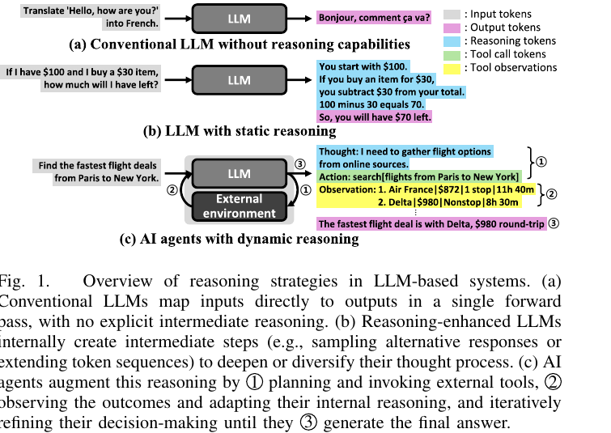

**📌 Figure 1 설명** — LLM 기반 시스템에서 가능한 세 가지 추론 전략을 비교한 개념도입니다.
- **(a) 추론 능력이 없는 기존 LLM**: 입력을 단일 forward pass로 출력에 매핑. 예: "Hello, how are you?"를 프랑스어로 번역.
- **(b) 정적 추론 LLM (static reasoning)**: 내부적으로 중간 단계를 생성 — 예: 대안 응답을 샘플링하거나 토큰 시퀀스를 확장. 예: "$100에서 $30 빼면…"을 단계별로 계산. 모든 reasoning이 LLM 내부에서 일어남.
- **(c) 동적 추론 AI Agent**: LLM이 ① 계획하고 외부 도구를 호출 → ② 결과를 관찰하고 내부 추론을 적응 → ③ 최종 답을 생성. 예: "Paris→New York 최저가 항공편 찾기" 질문에 대해 항공편 검색 도구를 호출, 결과(Air France $872, Delta $980 등)를 관찰하고 최저가를 결정.
- 토큰의 색깔이 다른 점에 주목: 회색=Input, 분홍=Output, 청록=Reasoning, 녹색=Tool call, 노랑=Tool observation. (c)는 다섯 가지 색이 모두 등장 — 즉, 정적 LLM 대비 컨텍스트 구성이 훨씬 다양하고 누적적임을 시사함.

### 2.4 이 논문이 메우려는 갭

저자들은 이 갭을 정확히 명문화합니다.

- **정적 reasoning LLM**의 serving 특성은 이미 잘 이해됨 (커뮤니티에 충분한 측정/최적화 연구가 존재).
- 그러나 **에이전트 serving 비용에 대한 종합적·시스템 수준 특성화는 아직 없다.**
- 본 논문은 다음 세 가지 축에서 정량 분석을 제공:
  1. **에이전트 워크플로우 자체의 특성**.
  2. **Serving 성능** (단일/다중 요청 시).
  3. **Test-time scaling이 비용에 미치는 영향**.
- 세 축이 각각 비용 구조의 한 차원을 다루고, 종합적으로 **인프라 수준의 함의**를 형성.

저자들의 명시적 기여 선언:

- **다양한 에이전틱 워크플로우를 가로질러 단대단(end-to-end) 인프라 거동을 정량 분석한 최초의 연구**.
- 핵심 목적: ① 동적 추론 배포의 **AI 인프라 비용을 정량 평가**, ② 알고리즘 능력과 실현 가능한 배포 사이의 격차를 메우기 위한 **지속가능 설계 원리의 시급성을 연구 커뮤니티에 환기**.
- 오픈소스 코드: <https://github.com/VIA-Research/AgentBench>.

---

## 3. Background and Motivation (배경 및 동기)

### 3.1 AI Agents의 정의 (Section II-A)

저자들은 **AI Agent**를 다음과 같이 정의합니다.

> **AI Agent란**, LLM의 능력을 **다단계 추론, 적응적 의사결정, 외부 환경과의 상호작용**으로 확장하는 **추론 시간(inference-time) 프레임워크**.

기존 LLM 응용과의 본질적 차이는 다음과 같습니다.

| 구분 | 기존 LLM 응용 | AI Agent |
|------|---------------|----------|
| 입출력 매핑 | 정적 prompt → 단일 output | 반복적 내부 추론 + 외부 행동 |
| 외부 도구 | 사용하지 않음 | 매 반복마다 호출 가능 (검색 엔진, 계산기, 코드 인터프리터 등) |
| 컨트롤 플로우 | 한 번의 forward pass | 동적으로 진화 |
| 컨텍스트 누적 | 없음 | 매 반복마다 도구 결과를 컨텍스트에 통합 |

이러한 **동적 적응성(dynamic adaptivity)** 이 복잡하고 개방형(open-ended)인 문제 해결 능력을 끌어올리지만, **LLM 호출 빈도·도구 사용 패턴·전체 계산 비용에 상당한 변동성(variability)** 을 동시에 도입합니다. 이 변동성이 곧 시스템 측면에서의 골칫거리가 됩니다.

### 3.2 AI Agent의 핵심 구성 요소 및 워크플로우 (Section II-B)

저자들은 AI Agent를 **5가지 요소**로 분해합니다 (Figure 2 참조).

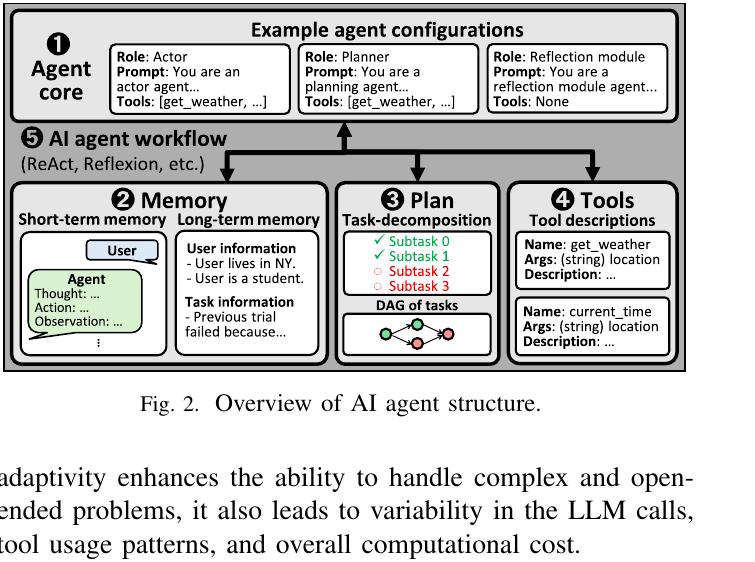

**📌 Figure 2 설명** — AI Agent의 5요소 구조와 그 상호작용을 시각화한 다이어그램입니다.
- **❶ Agent core**: 고급 추론을 담당하는 중앙 컴포넌트. 한 개 이상의 LLM이 특정 "역할(role)"을 부여받음. 대표적 역할:
  - *Actor* (배우): 다음 행동을 결정 (예: 프롬프트 "You are an actor agent...").
  - *Planner* (계획자): 고수준 목표를 하위 작업(subtask)으로 분해.
  - *Reflection module* (리플렉션 모듈): 이전 추론 단계와 도구 상호작용 궤적을 평가하고 향후 결정을 안내.
- **❷ Memory**: 추론 단계를 가로지르는 연속성을 부여. 단기 기억(short-term) = 사용자/에이전트의 대화 trace; 장기 기억(long-term) = 사용자 선호, 과거 경험, 작업 정보 (예: "User lives in NY. User is a student. Previous trial failed because…").
- **❸ Plan**: 에이전트의 목표를 하위 작업의 **시퀀스** 혹은 **유향 비순환 그래프(DAG)** 로 조직. 명시적 계획을 유지함으로써 우선순위 부여, 진행 추적, 전체 목표 정렬이 가능.
- **❹ Tools**: 외부 환경과의 상호작용을 가능케 함. 각 단계마다 에이전트가 현재 컨텍스트를 분석 → 도구·인자가 명시된 구조화 명령 생성 → 도구 호출 → 결과를 컨텍스트에 통합 → 다음 추론에 활용 (예: `get_weather(location: string)`).
- **❺ AI Agent workflow**: 위 네 요소가 어떻게 **반복적으로 상호작용**하는지를 정의 (ReAct, Reflexion 등이 서로 다른 패턴). 각 에이전트는 자기만의 워크플로우 패턴을 구현.

워크플로우는 크게 두 단계로 분해됩니다.

1. **LLM inference phase**: 행동 생성, 계획, 리플렉션 등 *내부 추론*.
2. **Tool use phase**: 도구를 통해 *외부 환경*과 상호작용.

이 두 단계가 번갈아 반복되는 것이 에이전틱 시스템의 골격입니다.

### 3.3 AI Agent에서의 Test-Time Scaling (Section II-C)

**Test-time scaling**의 일반적 정의는 다음과 같습니다.

> 사전학습된 LLM의 **추론 성능을, 모델 파라미터를 변경하지 않고, 추론 시에 더 많은 계산을 투입**해 향상시키는 방법 [75], [83], [84], [95], [104].

대표 기법:

- **Chain-of-Thought (CoT)** [84]: 신중하게 설계된 프롬프트로 중간 추론 단계를 강제 생성.
- **Tree-of-Thought** [95]: 여러 추론 경로를 탐색하여 추론 공간 확장.

핵심 아이디어: 파라미터를 그대로 유지하면서 모델의 내부 추론 능력을 **단계적으로(step-by-step)** 활용.

AI Agent는 이 패러다임을 한 단계 더 밀고 나갑니다.

- 프롬프트 설계만이 아니라, **도구 사용과 중간 추론 상태 유지**를 통합한 **다단계 의사결정** 으로 test-time 추론을 구현.
- 정적 입출력 매핑이 아닌, **여러 모델 호출과 도구 상호작용**을 동적으로 조율, **중간 결과에 따라 행동을 적응**.
- 이런 형태의 동적 추론은 새 정보에 대응, 이전 결정을 수정, 외부 환경 관련 실시간 작업 처리를 가능케 함.

즉, **AI Agent는 모델 내부 추론 능력에만 의존하는 기존 추론 방식을 넘어서 test-time scaling을 재정의**합니다. 그 결과 **효율성, 지연, 자원 관리에 새로운 도전을 도입**하므로 시스템 수준 분석이 절실히 필요합니다.

### 3.4 Motivation (연구 동기, Section II-D)

저자들은 동적 추론의 시스템적 부담을 다음과 같이 압축합니다.

- 기존 단일 턴 LLM 추론: 계산이 **단일 forward pass**로 제한.
- 에이전틱 실행: **동적으로 진화하는 컨트롤 플로우**, **여러 라운드의 LLM 추론**, **외부 도구 상호작용**.
- 결과: 시스템·인프라 수준에서
  - 상당한 컴퓨트 오버헤드.
  - 메모리 압력 증폭.
  - 예측 불가능한 지연 및 자원 활용 패턴.

그럼에도 불구하고 기존 연구는 다음을 간과해 왔습니다.

- AI Agent 연구 대부분이 **작업 성공률·정성적 추론 거동 개선**에 집중 [72], [96], [102].
- **배포 비용**에는 거의 관심이 없음.
- 정적·단일 패스 워크로드 대상의 기존 아키텍처/시스템 최적화가 **에이전트의 동적·반복적 특성을 포착하기에 부족**.

저자들의 동기는 이 갭을 **엄밀하고 정량적으로 메우는 것**입니다. 그들이 강조하는 이유는 강력합니다.

> **동적 추론의 시스템 수준 함의에 대한 원칙적 이해 없이는, 커뮤니티가 "어제의 워크로드"에 맞춰진 인프라를 만들게 될 위험이 있다.**

따라서 시스템 지향 관점이 **지속가능·효율·확장 가능한 serving 인프라 설계를 안내**하기 위해 필수적이라는 결론.

---

## 4. Methodology (실험 방법론)

### 4.1 분석 대상 AI Agent 5종

저자들은 추론 전략·도구 통합·계획 메커니즘을 폭넓게 커버하기 위해 다음 5가지 대표 에이전트를 선정했습니다.

1. **Chain-of-Thought (CoT)** [84] — 가장 단순한 베이스라인, 도구 없음.
2. **ReAct** [96] — 추론 + 도구.
3. **Reflexion** [72] — 추론 + 도구 + 리플렉션.
4. **Language Agent Tree Search (LATS)** [102] — 추론 + 도구 + 리플렉션 + 트리 검색(MCTS 기반).
5. **LLMCompiler** [31] — 추론 + 도구 + 구조화된 계획(DAG).

다섯 가지 핵심 기능의 유무를 Table I이 요약합니다.

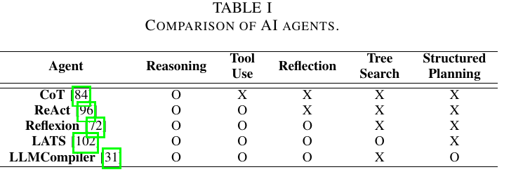

| Agent | Reasoning | Tool Use | Reflection | Tree Search | Structured Planning |
|-------|:---------:|:--------:|:----------:|:-----------:|:-------------------:|
| CoT [84] | O | X | X | X | X |
| ReAct [96] | O | O | X | X | X |
| Reflexion [72] | O | O | O | X | X |
| LATS [102] | O | O | O | O | X |
| LLMCompiler [31] | O | O | O | X | O |

**📌 Table I 해설** — 비교 매트릭스. 모든 에이전트가 reasoning은 갖되, 도구·리플렉션·트리 검색·구조화 계획 여부에서 갈림. CoT만 도구 없음(외부 환경 무상호작용). 본 연구의 정의상 **도구 없이 reasoning만 하는 CoT도 광의의 "AI agent"** 로 포함했는데, 이는 baseline 비교를 위함.

각 기능에 대한 저자의 부연:

- **Reasoning**: 모든 에이전트가 사용. CoT는 외부 도구 없이 순수 내부 reasoning만 (Figure 3(a)).
- **Tool use**: 언어 기반 에이전트와 외부 환경 상호작용 가능 에이전트를 가르는 기능. 실시간 데이터 접근, 비-언어적 연산 수행을 가능케 함.
- **Reflection**: 과거 결정을 평가하고 전략 수정. ReAct는 reasoning과 도구 사용을 단순 반복(Figure 3(b)). Reflexion은 가장 기본적 reflective agent로, **주기적 자기 평가와 reflection을 통한 정제**(Figure 3(c)).
- **Tree search**: LATS(Figure 3(d))는 **Monte Carlo Tree Search** [11]로 여러 추론·행동 분기를 시뮬레이션. 다양한 후보 경로를 평가한 뒤 결정.
- **Structured planning**: LLMCompiler는 **다단계 계획과 비동기 task 실행 스트리밍**으로 지연 최소화. 계획 단계에서 task 의존성을 분석해 **DAG**를 만들고, 의존적 도구 호출을 **단일 LLM 호출 안**에서 생성. 중간 도구 호출은 스케줄러로 스트리밍되어 **계획과 도구 호출의 비동기적 오버랩**이 가능(Figure 3(e)).

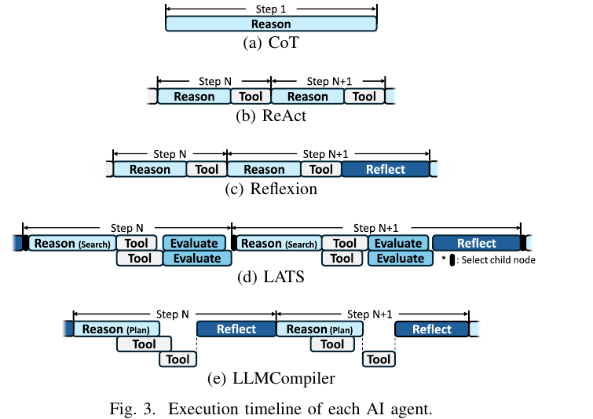

**📌 Figure 3 설명** — 5종 에이전트의 한 스텝(Step N→N+1) 실행 흐름을 시간축으로 나란히 시각화.
- **(a) CoT**: 단일 Reason 블록 (도구 없음).
- **(b) ReAct**: `Reason → Tool` 패턴이 매 스텝마다 반복.
- **(c) Reflexion**: ReAct에 `Reflect` 블록 추가. 즉 `Reason → Tool → ... → Reflect`.
- **(d) LATS**: 가장 복잡. `Reason(Search) → Tool → Evaluate`가 여러 자식 노드(child node)에서 병렬로 일어남. `*` 표시는 "select child node". 마지막에 `Reflect`.
- **(e) LLMCompiler**: 단계마다 `Reason(Plan)` → 여러 `Tool`이 **비동기 병렬로 실행됨** (점선으로 표시) → 다음 스텝의 `Reason(Plan)` → 또 도구들. **계획과 도구 호출이 오버랩**.

저자는 각 에이전트의 공식 오픈소스 구현 [30], [71], [97], [103]을 사용하되, 자체 평가 프레임워크에 맞게 적응시켰습니다. 특히 **LATS는 원본 구현 [103]이 LLM 추론과 도구 호출을 순차 실행해 지연이 악화되므로, 동시성(concurrent LLM inference + parallel tool invocation)을 지원하도록 최적화** 했습니다.

### 4.2 벤치마크 4종

다양한 다운스트림 에이전틱 작업을 대표하는 4종 벤치마크를 선정했습니다.

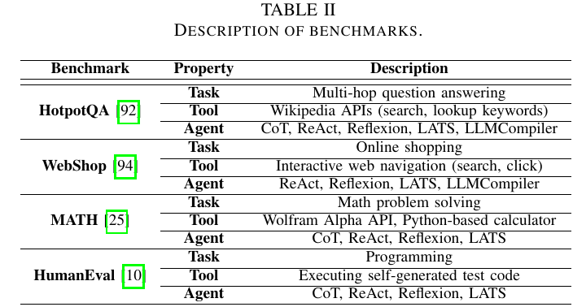

| Benchmark | Property | Description |
|-----------|----------|-------------|
| **HotpotQA** [92] | Task | Multi-hop QA (다중 홉 질문 답변) |
| | Tool | Wikipedia APIs (search, lookup keywords) |
| | Agent | CoT, ReAct, Reflexion, LATS, LLMCompiler |
| **WebShop** [94] | Task | 온라인 쇼핑 |
| | Tool | 인터랙티브 웹 탐색 (search, click) |
| | Agent | ReAct, Reflexion, LATS, LLMCompiler |
| **MATH** [25] | Task | 수학 문제 풀이 |
| | Tool | Wolfram Alpha API, Python 기반 계산기 |
| | Agent | CoT, ReAct, Reflexion, LATS |
| **HumanEval** [10] | Task | 프로그래밍 |
| | Tool | 자기 생성 테스트 코드 실행 |
| | Agent | CoT, ReAct, Reflexion, LATS |

**📌 Table II 해설** — 4종 벤치마크의 작업/도구/적용 에이전트를 정리.
- **HotpotQA**: 다중 홉 지식 집약적 질문에 대해 정확한 근거 retrieval 능력 평가. Wikipedia API [85]를 도구로 사용. 모든 5종 에이전트와 매칭.
- **WebShop**: 조건을 충족하는 상품을 찾는 웹 쇼핑 벤치마크. 웹 탐색 도구 제공. **CoT는 제외** (쇼핑 웹과 상호작용 불가).
- **MATH**: 다양한 도메인의 수학 문제. Wolfram Alpha API [86] + Python 계산기 제공. **LLMCompiler 제외** (DAG 계획이 순차적·단계적 추론에 부적합).
- **HumanEval**: 프로그래밍 능력 평가. Python 실행 도구로 self-written test code 검증. **LLMCompiler 제외**.

추가로, **에이전틱이 아닌(non-agentic) 데이터셋**으로 **ShareGPT** [70]을 사용. 사용자-ChatGPT 대화 모음 [53]으로, 외부 환경 상호작용 없는 단일 턴 LLM 추론(즉, 전형적 chatbot 워크로드)을 모델링.

### 4.3 LLM 백엔드와 하드웨어

- **LLM Backend**: **vLLM** (버전 0.6.6) — OpenAI 호환 serving 인프라. PyTorch 2.6 + CUDA 12.8. **Prefix caching** [32] 활성화 (공유 prefix에 대해 KV cache를 재사용해 중복 계산 제거). 별도 명시하지 않는 한 모든 실험은 prefix caching 활성화 상태로 수행.
- **기본 LLM**: **Llama-3.1-8B-Instruct** [45].
- **추가 모델 사이즈 분석**: **Llama-3.1-70B-Instruct** [44] (Section V).
- **Hardware** (Google Cloud Platform):
  - **8B 모델**: `a2-highgpu-1g` (12 vCPU = 6 physical cores, 85 GB RAM, **NVIDIA A100 40GB × 1**).
  - **70B 모델**: `a2-highgpu-8g` (96 vCPU = 48 physical cores, 680 GB RAM, **NVIDIA A100 40GB × 8**).

각주에서 저자는 **GPU에 한정한 분석이지만 본 연구의 통찰(에이전틱 컨트롤 플로우 직렬화, 긴 컨텍스트로 인한 KV cache 압력, idle period 활용 저하)은 아키텍처-불가지론(architecture-agnostic)** 이며 TPU 등 다른 가속기에도 그대로 적용 가능하다고 강조합니다.

---

## 5. Demystifying AI Agents (AI Agent의 본질 파헤치기)

이 장은 본 논문의 가장 큰 비중을 차지하는 측정 챕터입니다. 세 가지 축으로 분석합니다.

- **Section IV-A**: 단일 요청(single-request) 실행을 다룸. 에이전트가 한 번의 요청을 처리할 때의 LLM/도구 호출 패턴, 지연 분포, GPU 활용.
- **Section IV-B**: LLM 추론과 tool-calling의 세부 특성. 토큰 구성, prefix caching의 효과.
- **Section IV-C**: 다중 요청을 동시에 서빙(serving)할 때의 시스템 수준 병목.

### 5.1 Overall Workflow of AI Agents (Section IV-A)

#### 5.1.1 LLM 호출과 도구 호출이 지연에 미치는 영향

저자는 먼저 **요청당 LLM/도구 호출 횟수**의 평균을 측정합니다.

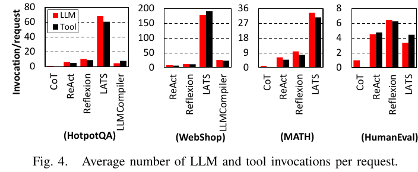

**📌 Figure 4 설명** — 4개 벤치마크 각각에 대해 5종 에이전트의 **요청당 평균 LLM 호출(빨강)·Tool 호출(검정) 횟수**를 막대그래프로 비교. Y축 스케일이 벤치마크마다 다름에 주목 (HotpotQA: 0~80, WebShop: 0~200, MATH: 0~36, HumanEval: 0~8).
- CoT는 어디서나 단 1회의 LLM 호출만 함.
- **LATS는 압도적으로 LLM 호출이 많음** — HotpotQA에서 60+ 회, WebShop에서 180회에 육박. 이는 트리 검색이 자식 노드 확장마다 별도의 LLM 추론을 호출하기 때문.
- ReAct·Reflexion·LLMCompiler는 비교적 비슷한 수.

**핵심 수치**:
- CoT 대비 도구 보조 에이전트의 평균 LLM 호출 = **9.2배**.
- LATS = **요청당 평균 71.0 LLM 호출** (가장 많음).

다음으로 **지연 시간 분해**.

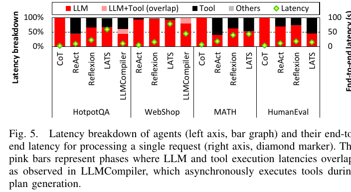

**📌 Figure 5 설명** — 좌측 y축은 각 단계의 **지연 비율(latency breakdown, %)** , 우측 y축은 단일 요청 처리에 걸린 **단대단 지연(초)** (다이아몬드 마커). 막대 색상:
- 빨강 = LLM (순수 LLM 추론)
- **분홍** = **LLM+Tool 오버랩** (LLMCompiler에서만 관찰됨 — 계획 생성 중 비동기 도구 실행)
- 검정 = Tool
- 회색 = Others
- 다이아몬드(녹) = 단대단 지연

해석:
- 대부분의 에이전트는 LLM/도구 호출 수가 비슷(Figure 4)하지만, 도구 호출이 지연에 기여하는 비중은 **벤치마크에 따라 크게 다름**.
- 이유는 도구 실행 지연의 차이:
  - **WebShop**: 로컬 호스팅 웹페이지와 상호작용하는 가벼운 도구. 호출당 ~20 ms.
  - **HotpotQA**: Wikipedia API. 호출당 평균 **1.2초** → 도구 실행이 전체 지연을 지배.
- 평균적으로 **LLM 추론 = 69.4%**, **도구 실행 = 30.2%** 의 지연 차지.
- 둘 다 무거운데 **순차 의존성(sequential dependency)** 때문에 오버랩이 어려움. 즉, "다음에 어떤 도구를 부를지" 결정하려면 LLM 출력이 필요하고, 그 다음 LLM 호출은 이전 도구의 관찰값에 의존.
- **LLMCompiler**가 중간 plan을 스케줄러로 스트리밍해 비동기 실행을 시도하지만, 관측된 오버랩은 **전체 지연의 18.2%에 불과**.

#### 5.1.2 에이전틱 워크플로우가 GPU 컴퓨트 활용에 미치는 영향

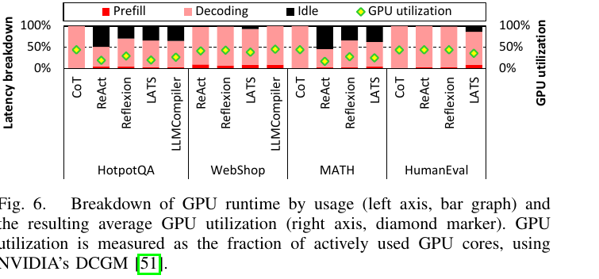

**📌 Figure 6 설명** — 좌축은 GPU 런타임 분해 비율, 우축은 평균 GPU 활용률 (다이아몬드 마커). GPU 활용률은 **NVIDIA DCGM** [51]을 이용해 "실제로 사용된 GPU 코어 비율"로 측정.
- 막대 색상: 빨강 = Prefill, 분홍 = Decoding, 검정 = Idle, 녹색 다이아몬드 = GPU utilization.

핵심 관찰:
- **CoT vs. 에이전트**: CoT는 단일 LLM 추론으로 끝나므로 외부 상호작용 없음. 에이전트는 도구 실행 시간 동안 GPU가 idle할 수 있음.
- Idle 시간의 길이는 **도구 지연**과 **도구가 GPU를 쓰는지 여부**에 의해 결정됨:
  - **WebShop**: 로컬 합성 웹과 상호작용, 도구 지연 짧음 → 높은 GPU idle 없음 (즉, 낮은 GPU util도 없음).
  - **HumanEval**: 도구 실행이 길지만(Figure 5), 호출하는 도구(테스트 생성 도구)가 **GPU에서 LLM 실행**을 함 → GPU idle 비율 최소.
  - **HotpotQA, MATH**: 도구가 로컬 CPU 또는 외부 시스템에서 실행 → **GPU idle이 전체 실행의 최대 54.5%** 까지 차지, GPU 활용률이 CoT 대비 현저히 낮음.
- **GPU가 LLM 실행 중인 시간** 안에서도 Prefill = 4.7%, Decode = 74.1%. 디코드 단계는 [2], [4], [8], [34]이 지적하듯 **memory-bound** → 디코드에 많은 시간을 쓸수록 GPU 자원이 추가로 활용 저하.

저자는 이로부터 중요한 시스템 시사점을 끌어냅니다:

> 단일 요청 내(intra-request)에서는 LLM-도구 순차 의존성 때문에 병렬 실행 기회가 제한됨. **자원 활용을 끌어올리려면 inter-request 병렬성(여러 사용자의 요청을 동시에 처리)** 을 활용해야 함. 이 지점이 Section IV-C로 이어짐.

#### 5.1.3 AI Agent의 단대단 지연 분포

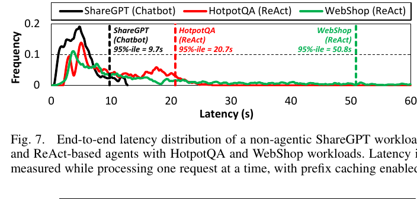

**📌 Figure 7 설명** — 단일 요청을 한 번에 하나씩(prefix caching 활성화) 처리할 때의 단대단 지연의 빈도 분포(frequency distribution, 곡선 형태). 비교 대상:
- **ShareGPT (Chatbot)** — 검정선. 95% 분위 지연 = **9.7초**. 분포가 좁고 일관적.
- **HotpotQA (ReAct)** — 빨강선. 95%-ile = **20.7초**. 분포가 훨씬 넓음.
- **WebShop (ReAct)** — 녹색선. 95%-ile = **50.8초**. 분포가 **매우 무거운 꼬리(heavy tail)** 를 가짐. 즉, 일부 요청이 50초 이상 걸리는 경우가 흔함.

해석:
- ShareGPT 같은 정적 chatbot 워크로드는 응답 생성에 단일 LLM 호출만 쓰므로, 지연이 **상대적으로 낮고 일관적**.
- 반면 ReAct 에이전트는 **다단계 추론과 외부 도구 의존성** 때문에 분포가 훨씬 넓고 무거운 꼬리. 추론 단계 수와 도구 호출 횟수가 요청마다 변동하므로 계산 수요가 출렁임. 결국 **에이전트는 요청별 지연 분산(variance)이 크고 예측 어렵다**.

### 5.2 LLM Inference 및 Tool-Calling 특성 (Section IV-B)

#### 5.2.1 입력·출력 토큰 분해

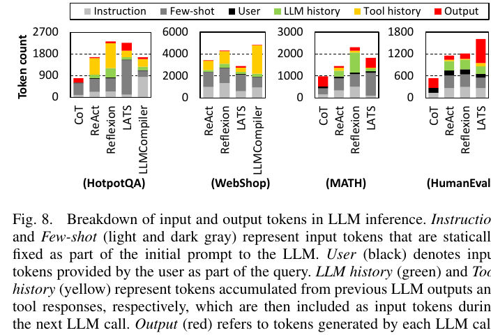

**📌 Figure 8 설명** — 4개 벤치마크 × 5종 에이전트에 대해, **요청 처리 동안 누적된 LLM 호출 입력/출력 토큰의 종류별 분포**를 스택 막대그래프로 보여줌. 토큰 종류:
- **Instruction** (밝은 회색): 역할/목표 정의, 정적 (예: "You are a planning agent...").
- **Few-shot** (어두운 회색): in-context example, 정적.
- **User** (검정): 사용자 쿼리.
- **LLM history** (녹색): 이전 LLM 출력의 누적.
- **Tool history** (노랑): 이전 도구 응답의 누적.
- **Output** (빨강): 각 LLM 호출이 생성한 출력 토큰.

여기서 **input** = Instruction + Few-shot + User + LLM history + Tool history. **output** = Output(빨강) 부분.

해석 (저자가 본문에서 강조):
- **에이전트는 CoT보다 입력 토큰이 일반적으로 더 많음** — 역할 정합 instruction(예: LLMCompiler는 구조화 계획 생성 요구) + 누적된 이전 LLM/도구 컨텍스트.
- **출력 토큰**은 LATS를 제외하면 일반적으로 CoT보다 작음 — 에이전트는 작업을 여러 단계로 분해하므로 전체 출력이 여러 LLM 호출에 분산됨. 반면 **LATS는 트리 노드 확장을 위해 한 LLM 호출이 여러 후보 샘플을 생성**하므로 CoT보다도 훨씬 긴 출력.
- 토큰 사용 패턴은 **작업 종류에 따라서도** 다름:
  - **HotpotQA·WebShop**(지식·의사결정 집약): 도구가 큰 응답(예: 웹페이지 전체)을 반환 → **tool history 토큰**(노랑)이 길어짐.
  - **MATH·HumanEval**(내부 추론 의존): LLM이 더 긴 자체 출력을 생성 → **LLM history 토큰**(녹색)이 더 큼.
- 대부분의 벤치마크에서 **입력 토큰이 반복(iteration)에 따라 상당히 증가**. 예외는 LATS — 루트부터 현재 노드까지의 경로만 포함하므로 모든 prior input을 합치지 않음.
- HotpotQA의 경우 **초기 입력이 ~1,000 토큰이지만 LLM 호출이 거듭될수록 3~4배 증가**. 결과적으로 연속된 LLM 호출의 입력은 공통 prefix를 많이 공유 → **prefix caching의 큰 기회**.

#### 5.2.2 Prefix caching이 컴퓨트 효율에 미치는 영향

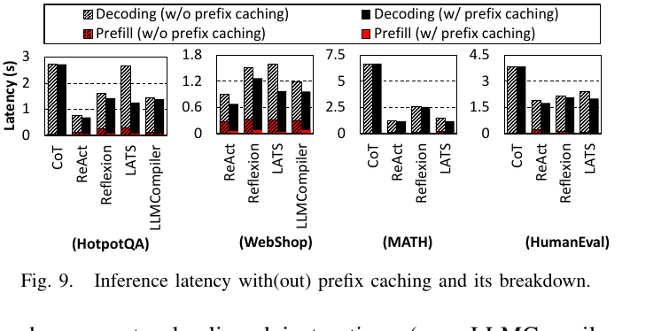

**📌 Figure 9 설명** — Prefix caching ON/OFF 시의 단일 LLM 호출 지연을 prefill·decoding으로 분해 비교. Y축 = 지연(초), 4개 벤치마크 × 에이전트. 막대 종류:
- 빗금 = Decoding (prefix caching OFF), 검정 = Decoding (ON).
- 빗금 빨강 = Prefill (OFF), 빨강 = Prefill (ON).

핵심 관찰:
- **Prefix caching** 덕분에 이미 계산된 KV cache가 재사용되어 prefill 단계의 중복 계산이 사라짐.
- CoT는 요청당 LLM 호출이 1회뿐이라 prefix 공유가 거의 없음 → 효과 작음.
- **에이전트 워크로드**(반복적 LLM 호출 + 누적 컨텍스트)에서는 효과가 큼:
  - **Prefill 지연 평균 60.1% 감소**.
  - 단대단 지연 평균 **15.7% 감소** — 모듈 단위 개선이 시스템에 큰 영향.
- Prefill 단축은 간접적으로 **decoding 효율**도 개선 — 토큰 수준 vLLM 스케줄러에서는 긴 prefill 단계가 동시 요청들의 스케줄링을 지연시키므로, prefill 단축이 스케줄링 효율과 처리량을 끌어올림 (Section IV-C, Figure 11에서 자세히 다룸).

#### 5.2.3 Prefix caching이 메모리 효율에 미치는 영향

저자는 GPU 메모리에서 가장 큰 비중인 **KV cache 크기**에 대해서도 prefix caching 효과를 측정:

- 도구 보조 에이전트는 CoT 대비 **요청당 평균 3.0배 (최악 5.4배)** 의 GPU 메모리 소비. 누적되는 reasoning 단계와 도구 응답이 컨텍스트를 길게 만들기 때문.
- 메모리 최적화의 필요성을 강조하며 prefix caching이 핵심 기법으로 거론됨.
- 특히 **LATS**: 트리 확장을 위해 여러 LLM 호출이 병렬로 발행됨. Prefix caching 없으면 각 호출이 자기 KV cache를 만들어 중복 → **prefix caching으로 평균 64.8% 메모리 절약**.
- 다른 에이전트는 LLM 호출들이 순차 실행되므로 단일 요청 안에서는 KV cache를 호출 간에 공유할 수 없음 (직전 호출이 끝나면 그 KV cache는 해제). 하지만 **다중 요청 동시 처리(serving) 시나리오에서는 prefix caching이 KV cache를 요청 간에 재사용**해 큰 메모리 효율 개선 (Section IV-C, Figure 12에서 자세히 다룸).

### 5.3 AI Agent Serving 특성 (Section IV-C)

지금까지의 분석은 단일 쿼리를 단독 처리하는 시나리오였습니다. 이 절에서는 **실제 production serving 환경** — 여러 요청이 동시에 들어오는 — 의 시스템 수준 거동을 분석합니다.

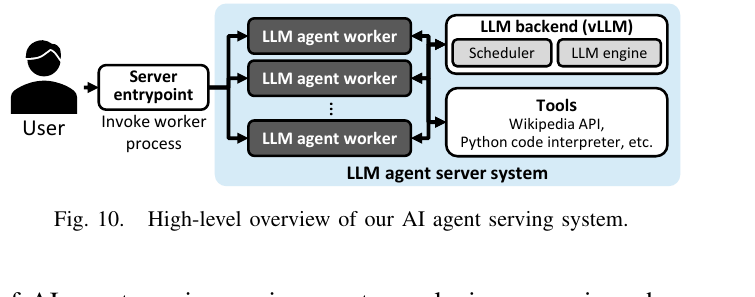

**📌 Figure 10 설명** — 저자들이 구현한 AI agent serving 시스템의 고수준 아키텍처. 구성:
- 사용자 → **Server entrypoint** → **다수의 LLM agent worker** → **LLM backend (vLLM)** (Scheduler + LLM engine) + **Tools** (Wikipedia API, Python interpreter, 등).
- 사용자 요청이 entrypoint에 도착 → worker 프로세스가 invoked → worker가 에이전트 워크플로우에 따라 처리 → 각 스텝에서 LLM 추론 서버에 요청을 보내거나 도구 실행. **로컬 도구 실행**(코드 인터프리터 등)과 **외부 도구**(웹 검색, API 호출)가 다 가능. 도구 실행은 **비동기** 처리. 각 worker가 보낸 LLM 추론 요청은 backend에서 **continuous batching** [32], [98]으로 묶임. 본 연구는 vLLM의 기본 **FCFS (first-come-first-served) 스케줄러** 사용. 트래픽은 **Poisson distribution** [47]을 따르도록 시뮬레이션.

#### 5.3.1 동시 요청 스케줄링의 중요성

저자는 먼저 **순차 실행 vs. 동시 실행** 의 처리량 차이를 측정.

- ReAct 에이전트를 **순차 처리** 시: 평균 지연 HotpotQA 9.6초, WebShop 5.3초. 처리량 각각 **0.10 QPS**, **0.19 QPS** (매우 낮음).
- **동시 처리** 시: 처리량 HotpotQA **2.6 QPS** (**25배 증가**), WebShop **1.2 QPS** (**6.2배 증가**) — 평균 지연은 2.1배 증가 비용 지불.
- HotpotQA의 처리량 이득이 더 큰 이유: 도구 지연이 길어 GPU가 오래 idle → 다른 요청을 처리할 시간이 충분히 생김.

#### 5.3.2 정적 chatbot 대비 비교

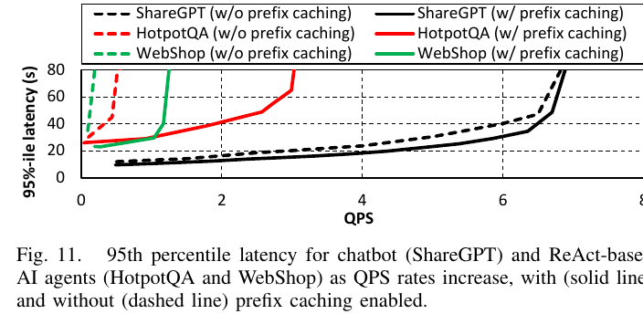

**📌 Figure 11 설명** — X축 = QPS, Y축 = 95%-ile 지연(초). 6개 곡선: ShareGPT/HotpotQA/WebShop × prefix caching 유무(실선=ON, 점선=OFF).
- **ShareGPT (검정)**: prefix caching 유무 관계 없이 거의 유사. QPS 6 부근까지 거의 평탄, 그 이후 급격히 상승.
- **HotpotQA (빨강)**: 점선(OFF)은 QPS 1 부근에서 이미 80초 도달. 실선(ON)은 QPS ~2.6까지 견딤.
- **WebShop (녹색)**: 점선(OFF)은 QPS 0.5 이전에 80초 도달. 실선(ON)은 QPS ~1.2까지.

해석:
- **Peak throughput** = 꼬리 지연 곡선의 무릎점(knee). ShareGPT = **6.4 QPS**, ReAct on HotpotQA = **2.6 QPS**, on WebShop = **1.2 QPS**.
- **ReAct가 prefix caching에도 불구하고 ShareGPT보다 훨씬 낮은 처리량**을 보임. 이는 다단계 추론과 누적 컨텍스트 때문.

#### 5.3.3 Prefix caching이 serving 처리량에 미치는 영향

- **ShareGPT**: 처리량 1.03배 향상 (단일 LLM 호출이라 반복 적음 → prefix 재사용 거의 없음).
- **ReAct**: **평균 5.62배 처리량 향상**. 에이전트 워크로드는 요청당 여러 LLM 호출과 누적 컨텍스트를 가지므로 prefix caching이 중복 prefill을 피해 큰 이득.
- 성능 갭의 추가 원인: **토큰 수준 배치 시스템(vLLM)의 특성**. Prefix caching 없으면 긴 prefill 단계가 GPU와 디코딩을 점유하므로, 다른 요청들이 시스템 wide queueing delay를 겪음. Prefix caching이 이 inter-request 간섭을 완화 → 특히 에이전틱 워크로드에 결정적.

#### 5.3.4 Prefix caching이 메모리 사용량에 미치는 영향

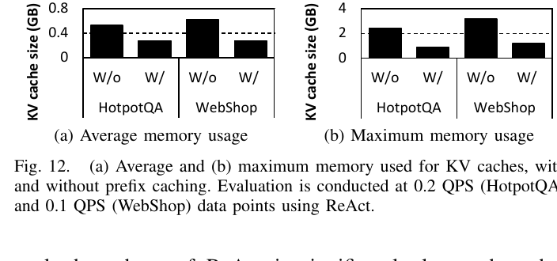

**📌 Figure 12 설명** — (a) 평균 사용량, (b) 최대 사용량. ReAct로 HotpotQA(0.2 QPS), WebShop(0.1 QPS)에서 측정. W/o = prefix caching off, W/ = on.
- (a) 평균: HotpotQA W/o ≈ 0.55 GB → W/ ≈ 0.27 GB. WebShop W/o ≈ 0.6 GB → W/ ≈ 0.27 GB. 둘 다 약 절반.
- (b) 최대: HotpotQA W/o ≈ 2.5 GB → W/ ≈ 0.9 GB. WebShop W/o ≈ 3 GB → W/ ≈ 1.2 GB. 1/3 이하로 감소.

저자 평가:
- **평균 KV cache 사용량 51.7% 감소, 최대 63.5% 감소**. Serving 시 prefix caching이 KV cache 메모리 풋프린트를 크게 줄여 GPU 메모리 자원을 효율 활용.

---

## 6. Demystifying Test-Time Scaling in AI Agents

이 장에서는 **AI 에이전트의 다양한 설계 공간(design space)** 을 탐색하면서, **test-time scaling 거동** — 즉, 추론 시 계산을 더 쓰면 정확도가 어떻게 변하는지 — 의 트레이드오프를 다룹니다. 평가 프로토콜은 벤치마크 별로 표준을 따랐습니다.

- **HotpotQA, MATH**: exact match accuracy (MATH는 동등한 수식 변형 허용).
- **WebShop**: 벤치마크에 정의된 task-specific score.
- **HumanEval**: 모든 단위 테스트를 통과한 작업 비율.
- 각 설계 포인트마다 **50 sample question** 으로 평균 정확도와 계산 비용을 측정.

### 6.1 AI Agent 설계 공간에 따른 비용-효율성 분석 (Section V-A)

#### 6.1.1 정확도-비용 파레토 분석

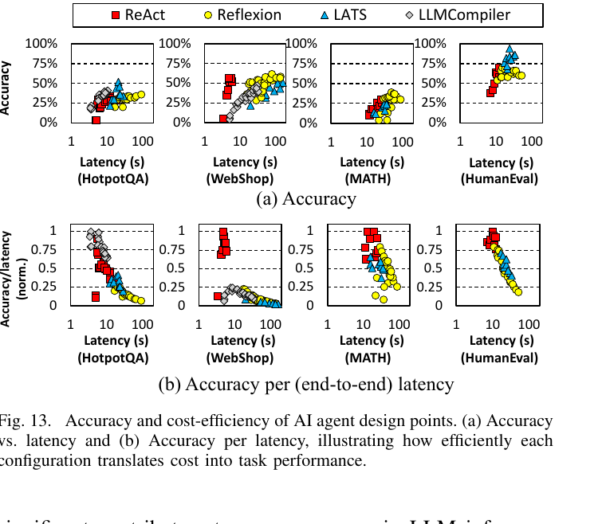

**📌 Figure 13 설명** — 4개 벤치마크 × 4종 에이전트(ReAct, Reflexion, LATS, LLMCompiler)에 대해 다양한 설계 변형 포인트들을 산점도로 시각화. 마커: ReAct=빨강 사각형, Reflexion=노란 동그라미, LATS=파란 삼각형, LLMCompiler=회색 다이아몬드.
- **(a) Accuracy**: X축 = Latency(초, log scale 1~100), Y축 = Accuracy(%). 일반적으로 우상향(컴퓨트 증가 → 정확도 증가) 추세, 그러나 수확체감.
- **(b) Accuracy/latency (norm.)**: 정확도 ÷ 지연 비율 (정규화). 비용-효율성을 가시화. 작은 지연에서 더 높은 효율, 큰 지연으로 갈수록 떨어짐 (즉, 추가 컴퓨트의 한계 이득 감소).

해석 (저자가 본문에서 강조):
- **ReAct**: 모든 벤치마크에서 **강한 컴퓨트 효율**. 일관되게 낮은 지연으로 적당한 정확도 달성.
- **Reflexion**: ReAct 위에 reflection 단계 추가. **적당한 정확도 향상**이지만 **지연 크게 증가**.
- **LATS**: 트리 기반 추론으로 여러 후보 분기 탐색 → **가장 높은 정확도**, 그러나 트리 확장 때문에 상당한 계산 오버헤드.
- **LLMCompiler**: 계획 기반 아키텍처. HotpotQA에서 ReAct를 능가 (정확도·비용-효율 모두) — 구조화된 plan을 만들고 병렬 실행 가능하기 때문. 그러나 **WebShop처럼 도구 사용에 의존성 큰 작업**(웹 페이지 검색·클릭)에서는 DAG-스타일 계획이 **불필요한 도구 호출**을 만들어 ReAct보다 효율이 떨어짐.
- 모든 에이전트·워크로드에 걸친 공통 패턴: **컴퓨트 비용이 늘면 정확도가 늘지만 수확체감**. 따라서 에이전트 serving 시스템 설계는 **단순히 정확도만 최적화하지 말고, 비용을 균형 있게 고려한 Pareto frontier 부근에서 동작해야 함**.

#### 6.1.2 비용-효율적 에이전트 동작을 위한 iteration·prompting 튜닝

두 핵심 파라미터의 영향 분석:
- **Maximum iteration budget**: 쿼리당 허용된 reasoning/tool 호출 횟수.
- **Few-shot example 수**: prompt에 포함되는 in-context 예시 개수.

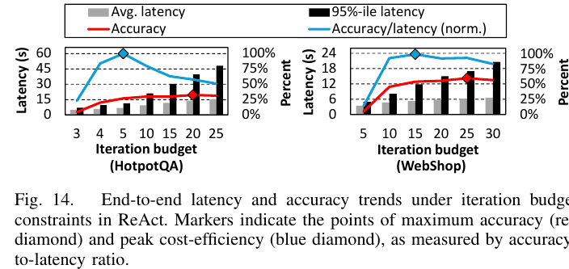

**📌 Figure 14 설명** — HotpotQA(왼쪽)와 WebShop(오른쪽)에서 ReAct의 iteration budget을 변화시킨 결과.
- 회색 바 = 평균 지연(s), 검정 바 = 95%-ile 지연(s), 빨간 선 = Accuracy(%), 파란 선 = Accuracy/latency(정규화).
- **빨강 다이아몬드** = 최대 정확도 지점, **파랑 다이아몬드** = 피크 비용-효율(accuracy-to-latency 비율).

해석:
- Iteration budget이 늘면 처음엔 정확도가 개선되지만 **양쪽 다 곧 포화**. 평균 지연도 포화.
- 그러나 **95%-ile 지연은 계속 선형으로 증가** — 소수의 outlier 작업이 budget 전체를 소진해 정확도엔 큰 기여 없이 latency 분포의 꼬리만 늘림.
- 이러한 outlier들은 **예측성을 떨어뜨려** 지연 민감 배포에 특히 문제. 결론: **iteration budget은 성능뿐 아니라 latency 일관성과 운영 안정성을 위해 튜닝해야 함**.

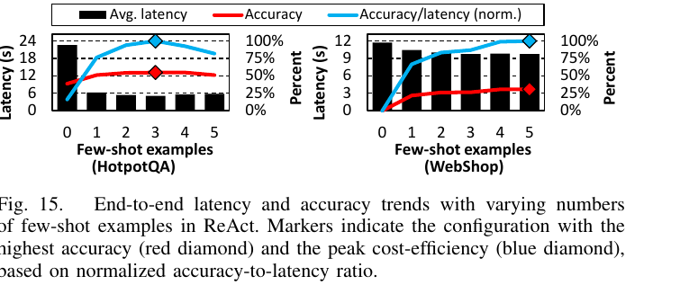

**📌 Figure 15 설명** — HotpotQA·WebShop에서 ReAct의 few-shot 예시 수를 0~5로 변화.
- 검정 바 = 평균 지연(s), 빨간 선 = Accuracy(%), 파란 선 = Accuracy/latency.

해석:
- Few-shot 예시 추가는 초기에 **정확도를 크게 향상**. 그러나 **일정 수 이후부터 한계 이득이 감소하거나 오히려 정확도 하락** — prompt 길이가 모델의 최적 처리 범위를 초과.
- **흥미로운 발견**: few-shot이 늘수록 **평균 지연이 오히려 감소**. 좋은 예시가 문제를 더 적은 reasoning 단계로 풀게 도와 토큰당 처리 시간 증가 비용을 상쇄.
- **요약**: 신중히 선택한 소수의 예시가 정확도·효율 모두를 개선하지만, 과도한 prompting은 수확체감 (또는 부정적 효과).

**최적 설정 식별 가이드**: Figure 14·15에서 **파란 다이아몬드 = accuracy-to-latency 비율 최대 지점** = **가장 비용-효과적 트레이드오프**. iteration budget·few-shot 수를 결정할 때 latency/compute 제약 하의 실용적 가이드 제공.

### 6.2 AI Agent의 Test-Time Scaling (Section V-B)

저자는 두 가지 test-time scaling 형태를 정의:
- **Sequential scaling**: 시간이 지남에 따라 reasoning 단계를 점진적으로 늘리는 방식 (Reflexion·LATS가 reflection step 수를 키울 때).
- **Parallel scaling**: 여러 reasoning 분기를 동시에 발행 (LATS의 트리 확장에서 자식 노드 수 증가).

#### 6.2.1 Sequential vs. Parallel Scaling 비교

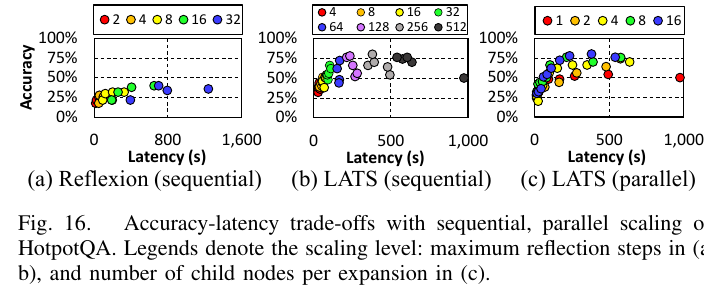

**📌 Figure 16 설명** — HotpotQA에서 세 가지 설정:
- **(a) Reflexion (sequential)**: 최대 reflection step 수 = 2,4,8,16,32. X축 = Latency(s, 0~1,600+).
- **(b) LATS (sequential)**: 최대 reflection step 수 = 4, 8, 16, 32, 64, 128, 256, 512.
- **(c) LATS (parallel)**: 확장당 자식 노드 수 = 1,2,4,8,16.

핵심 결과:
- **Sequential scaling**: 둘 다 reflection step↑ → accuracy↑ 이지만 **수확체감**.
  - 예: Reflexion에서 latency **16.9s → 25.6s로 +8.7s 늘려 4% accuracy 증가**. 그러나 **56.0s 시점에서 동일한 4% 추가 이득을 얻으려면 latency를 +269.5s 더 늘려야 함**(총 ~325.5s까지). 같은 한계 이득을 위해 **두 증분 비교 시 269.5÷8.7 ≈ 31배 더 비싼 비용**(원문: "a 31× higher cost for the same marginal gain").
- **Parallel scaling** (LATS, (c)): **child node 1→16으로 늘리면 정확도 14.4%p 증가하면서 동시에 평균 지연 196.3s 감소**! 병렬 분기 평가가 빠르게 고품질 답에 수렴하게 도와줌. 단, **메모리 압력 증가, 동시 LLM 호출 폭증** — 다중 테넌트나 자원 제한 환경에서 확장성 제약.

저자의 정책 시사:
- **지연 민감 워크로드**: parallel scaling이 유리 — 여러 경로를 동시에 탐색해 빠르게 좋은 답 도달.
- **자원 제약 환경**: sequential scaling이 유리 — 동시 LLM 호출 회피로 피크 자원 수요 낮춤. 단계적 reasoning 비용으로 더 긴 지연을 감수.

#### 6.2.2 모델 사이즈가 test-time scaling에 미치는 효과

저자는 **Llama-3.1-Instruct 8B vs 70B** 두 모델 사이즈에서 동일한 test-time scaling을 비교합니다.

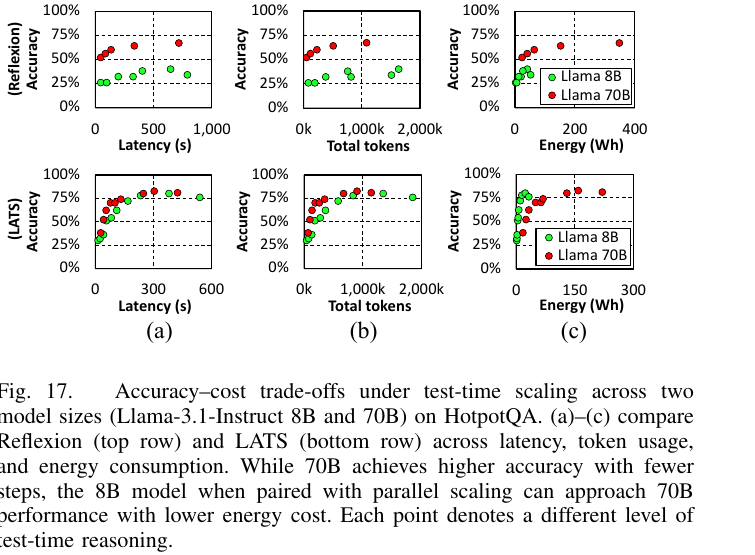

**📌 Figure 17 설명** — HotpotQA에서 Reflexion(상단 행)과 LATS(하단 행)를 8B(녹색)·70B(빨강) 모델로 비교. 세 축:
- **(a) Accuracy vs. Latency(s)**: Reflexion 8B는 ~1000s까지 늘려도 70B 수준에 못 미침. LATS는 8B가 200s 부근에서 70B 근처 정확도 달성 가능.
- **(b) Accuracy vs. Total tokens**: 8B는 70B 수준 정확도 도달에 훨씬 더 많은 토큰 소비.
- **(c) Accuracy vs. Energy(Wh)**: **8B가 70B보다 상당히(substantially) 에너지 효율적** — 70B는 8개 A100 GPU를 사용하는 데 비해 8B는 단 1개의 A100만 사용, 더 많은 추론 단계가 필요해도 요청당 총 에너지가 더 낮음. Reflexion plot에서 70B는 400 Wh 가까이 쓰지만 8B는 그 일부; LATS plot에서도 8B(0~150 Wh)가 70B(0~300 Wh)보다 적은 에너지로 비슷한 정확도 달성.

해석:
- **8B vs 70B**: 둘 다 결국 정확도 포화. 70B는 **더 적은 단계로 더 빨리 도달**.
- **8B는 더 많은 토큰을 소비**하며 high-accuracy 설정에선 더 긴 추론 시간 필요.
- 그러나 **에너지 측면에선 8B가 상당히 효율적** — 단일 GPU vs 8 GPU 차이.
- 흥미로운 통찰: **효과적 test-time 전략으로 모델 사이즈 격차를 부분적으로 메울 수 있다**. Reflexion(sequential)으론 8B의 한계가 보이지만, **8B + LATS + parallel scaling은 70B에 근접하는 성능을 더 낮은 에너지로 달성**.

---

## 7. AI Infrastructure Implications (AI 인프라적 함의)

이 절은 본 논문에서 가장 충격적인 결과를 담은 부분으로, 에이전틱 test-time scaling이 **GPU 에너지 소비**와 **데이터센터 전력 수요**에 미치는 영향을 정량화합니다. Section V-B의 가장 높은 정확도 설정을 기준으로 Reflexion(sequential)·LATS(parallel)를 대표로 사용.

### 7.1 GPU 에너지 소비

단일 요청 처리에 드는 평균 GPU 에너지(Wh/쿼리):

| Backbone LLM | Agent | 에너지 (Wh/query) |
|---|---|---|
| **Llama-3.1 8B** | Reflexion | **41.53 Wh** |
| | LATS | **22.76 Wh** |
| | ShareGPT (baseline) | 0.32 Wh |
| **Llama-3.1 70B** | Reflexion | **348.41 Wh** |
| | LATS | **158.48 Wh** |
| | ShareGPT (baseline) | 2.55 Wh |

(자세한 수치는 Table III 참조.)

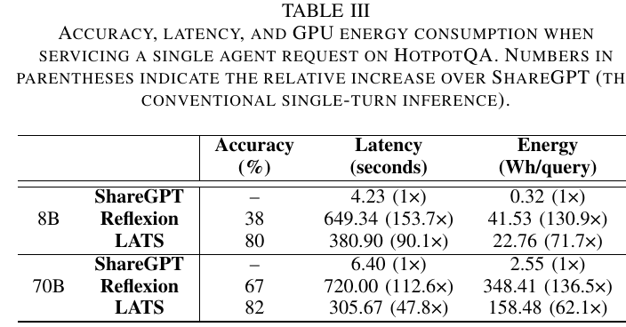

**📌 Table III 해설** — 1 쿼리당 정확도(%)·지연(초)·에너지(Wh/query)를 8B·70B 모델별로 ShareGPT, Reflexion, LATS에 대해 표기. 괄호는 **ShareGPT (정적 1-turn 추론) 대비 상대 증가 배수**:

| 모델 | Workload | Accuracy | Latency | Energy |
|------|----------|---------:|--------:|-------:|
| **8B** | ShareGPT | – | 4.23 (1×) | 0.32 (1×) |
| | Reflexion | 38 | **649.34 (153.7×)** | **41.53 (130.9×)** |
| | LATS | 80 | **380.90 (90.1×)** | **22.76 (71.7×)** |
| **70B** | ShareGPT | – | 6.40 (1×) | 2.55 (1×) |
| | Reflexion | 67 | **720.00 (112.6×)** | **348.41 (136.5×)** |
| | LATS | 82 | **305.67 (47.8×)** | **158.48 (62.1×)** |

핵심 수치: **에이전트 기반 test-time scaling은 ShareGPT 대비 쿼리당 GPU 에너지를 62.1배~136.5배 늘림**.

### 7.2 일별·시스템 단위 에너지 환산

ChatGPT의 주간 활성 사용자(WAU)는 최근 추정으로 **약 5억~12.7억** [15], [58], [60], [73] → 일일 활성(**DAU**) 약 **7,140만~1.81억**.

- **보수적 추정**: 7,140만 DAU × 사용자당 단일 agentic query 1회/일을 가정 시,
  - **Reflexion 8B**: 일일 GPU 에너지 약 **2.97 GWh**.
  - **Reflexion 70B**: 일일 GPU 에너지 약 **24.89 GWh**.
- 이는 LLM 요청 batching의 효과를 무시한 **하한 추정치**. 게다가
  1. 단일 query/유저/일 가정은 매우 보수적 — 실제 사용은 가속화/증가 중.
  2. GPU 에너지만 계산. CPU·메모리·네트워크·스토리지·냉각 미포함.
  3. 우리가 쓴 70B 모델조차 오늘날 수천억~수조 파라미터 모델 [3], [13], [18], [46]보다 자릿수 작음.
- **참조점**: **Seattle 광역권의 일일 전력 소비 = 24.8 GWh** [68]. 즉 Reflexion 70B 단일 워크로드가 시애틀 한 도시의 일일 전력에 맞먹음.
- AI 에이전트가 일상에 깊이 통합되면 **쿼리 양이 전통 검색 엔진 수준에 접근하거나 초과**할 수 있음. Google 검색은 일 **137억 쿼리**(=7,140만의 **192배**) [50]. 만약 그 규모로 사용 패턴이 옮겨가면 **AI 인프라 수요가 사이클로 급증**해 지속가능 한계 초과 위험.

### 7.3 데이터센터 단위 전력 수요

평균 전력 = (Wh/query) × (Queries/day) / (24 hours)로 환산.

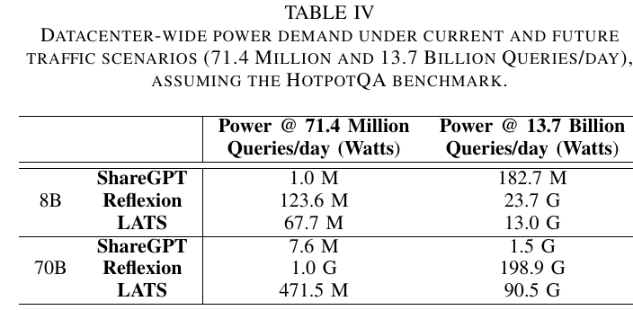

**📌 Table IV 해설** — HotpotQA 기준, 두 시나리오:
- "7,140만 쿼리/일" = 현재 ChatGPT DAU 가정.
- "137억 쿼리/일" = Google 검색 수준 가정.

| Backbone | Workload | @ 71.4 M queries/day | @ 13.7 B queries/day |
|----------|----------|---------------------:|---------------------:|
| **8B** | ShareGPT | 1.0 M (=1 MW) | 182.7 M (=182.7 MW) |
| | Reflexion | **123.6 MW** | **23.7 GW** |
| | LATS | 67.7 MW | 13.0 GW |
| **70B** | ShareGPT | 7.6 MW | 1.5 GW |
| | Reflexion | **1.0 GW** | **198.9 GW** |
| | LATS | 471.5 MW | 90.5 GW |

해석:
- **오늘날 7,140만 쿼리/일에서**:
  - ShareGPT 70B = 7.6 MW (현대 데이터센터 일반 영역).
  - **8B 기반 에이전트 = 67.7~123.6 MW**(범위 내: 8B LATS = 67.7 MW, 8B Reflexion = 123.6 MW; 중형 미국 도시 부하 수준).
  - **70B 기반 에이전트 ≈ 1 GW**(특히 70B Reflexion = 1.0 GW, 70B LATS = 471.5 MW; 단일 턴 LLM baseline의 약 **3 자릿수 배**).
- **OpenAI Stargate 다중 GW급 시설**이 정확히 이 미래에 대응하는 규모.
- 게다가 모델은 더 커지고 사용 패턴은 더 강화될 가능성 → 위 수치는 **하한**.
- **만약 Google 검색 규모(137억 쿼리/일)** 까지 확장되면:
  - **ShareGPT 70B = 1.5 GW**, **Reflexion 70B = 200 GW (=198.9 GW)**.
  - 200 GW는 **Meta가 2030년 가동 계획한 5 GW급 Hyperion** [74]을 훨씬 초과.
  - 200 GW = **미국 전체 전력 평균 부하의 약 절반(미국 평균 = 4,178 × 10³ GWh / (365×24) = 476.9 GW)** [81].
  - 이 규모는 보통 **국가 단위 탈탄소화 계획**에서나 거론되는 수치이지, 단일 산업·기술 하나에 할당될 수 없음. 산업·전송망·지속가능성 계획 전체를 근본적으로 재편하는 차원.

### 7.4 에이전틱 test-time scaling의 지속가능성 도전

저자는 결론적으로 다음을 강조:

- **AI 에이전트 성능은 그에 수반되는 컴퓨트·에너지·전력 비용에 비례 확장되지 않음.**
- 정확도가 포화한 뒤에도 test-time scaling을 더 쓰면 **수확체감하면서도 시스템 부담은 크게 가중**.
- 이 비효율은 **이론에 머무르지 않음** — 실제 배포에서도 구체적 제약을 가함.
  - **OpenAI Deep Research** [57]: 복잡한 다단계 추론을 위해 설계, **요청당 최대 30분 소요** [56].
  - 인프라 비용을 관리 가능한 수준으로 유지하기 위해 **ChatGPT Plus 유저당 30일에 25 run으로 제한** [56].
- 즉, **현실 가격 한계가 이미 알고리즘 욕심을 제약하고 있음**.

따라서 저자는 **무제한 test-time scaling에서 벗어나, 컴퓨트-인지(compute-aware)** 한 워크플로우 — 효율적 추론으로 강한 성능을 내는 — 로의 이동을 주장합니다.

---

## 8. Discussion (논의)

### 8.1 지속가능한 AI Agent serving의 미래 방향

저자는 직접 다루지는 않았지만, agentic serving 시스템 설계에 결정적일 세 갈래 방향을 제시합니다.

1. **모델 수준 최적화** — quantization [19], [38], [89], distillation [24], [26], [49], [77], sparse architectures [17], [37], [99], adaptive model routing [16], [59]. 또한 **다중 에이전트 시스템에서 SLM(Small LM)과 LLM을 이종 혼합** — 역할·작업 중요도(예: planning vs. acting)에 따라 동적으로 적절한 모델 선택. 비용·지연을 크게 줄일 수 있는 접근 [6].
2. **탄소 인지 컴퓨팅(Carbon-aware computing)** [22], [35], [65]: latency-sensitive 하지 않은 에이전트라면 **시간/위치에 따라 탄소 강도·전력비가 낮은 인스턴스로 이전**해 실행. 환경·경제 양면 이득.
3. **적응적 스케일링 전략(Adaptive scaling)** [64], [76], [91]: task 난이도·중요도에 따라 컴퓨트를 동적으로 배분 → over-provisioning 없이 서비스 품질 유지.

이 세 가지가 결합되면 에이전트 serving의 효율성·지속가능성·확장성이 크게 향상될 수 있음.

### 8.2 SLA 제약 하의 에이전트 serving

저자는 다음의 솔직한 한계를 명문화:
- 산업계는 이제 막 에이전틱 시스템을 탐색하기 시작, **표준 SLA가 아직 정립되지 않음**. 따라서 특정 latency target을 정해 분석하지 않았음.
- 본 연구의 목표는 **다양한 에이전트 설정에 걸쳐 에너지-효율 트레이드오프를 특성화**하는 것이지, 특정 SLA 최적화가 아님.
- 현 단계에서 에이전트는 일반적으로 **더 많은 컴퓨트 시간을 소비해 더 높은 추론 품질을 얻는 것이 허용**되고 있음 → 저자들의 분석은 의도적으로 **무제한 test-time scaling의 비효율을 부각**시키는 방향으로 설계됨, **에너지 인지 SLA 설계의 필요성을 환기**.
- 효율적 에이전트 serving under SLA constraints는 **향후 연구로 남김**.

---

## 9. Related Work (관련 연구)

### 9.1 AI Agent Workflows
- **단일 에이전트 프레임워크**: ReAct [96], Reflexion [72], LATS [102], LLMCompiler [31] — 각각 반복적 reasoning·tool 사용·reflection을 통한 의사결정 강화.
- **다중 에이전트 시스템**: CAMEL [36], AutoGen [87] — 작업 실행 구조화, 의사소통, 협응 행동 확장.
- 본 논문은 이런 워크플로우들의 **시스템 수준 함의를 처음 종합 분석** (직교적 관점).

### 9.2 AI Agent Interfaces
- **OpenAI function-calling API** [54]: 검증 가능하고 일관된 도구 호출 메커니즘 표준화.
- **Anthropic Model-Context Protocol (MCP)** [5]: 컨텍스트·도구 상호작용 관리 형식화.
- **Google Agent-to-Agent (A2A)** [21]: 다중 에이전트 통신 표준.
- 이들은 인터페이스/프로토콜 표준화에 집중 — 본 논문은 워크로드의 인프라적 도전(test-time scaling 측면)을 직교적으로 다룸.

### 9.3 시스템 수준 에이전트 최적화
- **LLMCompiler** [31], **Alto** [67], **Ayo** [78]: 파이프라인·병렬 실행으로 reasoning 단계 간 추론 지연 단축.
- **Autellix** [43]: queue-aware 스케줄링으로 지연 최적화.
- **AI Metropolis** [90], **Murakkab** [9]: 다중 에이전트 조율·자원 격리.
- 본 연구는 이런 컴포넌트별 최적화 연구와 달리, **다양한 에이전트 스케일에 걸친 인프라 거동·효율 트레이드오프를 더 폭넓게 특성화**.

### 9.4 LLM 추론 최적화 기법

저자는 본 논문이 표준 LLM 최적화(prefix caching, vLLM 등 [32], [100])에 집중함을 명시하고, 다른 옵션들과 에이전트 워크로드에 대한 적용 가능성을 정리:

- **KV cache 관리**:
  - **Hierarchical caching** [20], [29], [33]과 **non-prefix KV cache reuse** [93]: 단순 prefix caching을 확장해 더 효율적인 KV 재사용 → 에이전트에 잠재력 큼.
  - **Token pruning** [1], [23], [42] or **KV cache compression** [40], [41]: KV 메모리 풋프린트 축소. 아키텍처 차원의 개선으로 **GQA(Grouped-Query Attention)** [4]와 **DeepSeek-V2의 multi-head attention 변형(MLA)** [39] 등이 KV cache 메모리 풋프린트를 줄임. 긴 컨텍스트 에이전트 워크로드에 특히 유용.
- **Decoding 최적화**:
  - **Speculative decoding** [34]: 다중 후보 토큰을 예측·병렬 검증해 디코드 지연 감소. **에이전트의 출력은 종종 예측 가능한 스키마 패턴**(예: JSON 구조, function arguments) → speculative 분기 수용률이 높아 효과 큼.
- **Prefill-decode disaggregation** [52], [61], [101]: 컴퓨트 집약 prefill과 메모리 바운드 decode를 분리해 자원 할당 유연성·효율 개선. 긴 컨텍스트 에이전트에서 prefill 부하 ↑ 시 둘 사이 간섭 완화에 효과적.

저자는 모든 최신 최적화를 다 적용/측정한 것이 아니라, 가장 널리 채택되고 즉시 가용한 표준(prefix caching 등)에 집중했다고 명시 — 추가 최적화 공간은 향후 연구로 남김.

---

## 10. Conclusion (결론)

저자들의 마무리 메시지를 그대로 옮기면 다음과 같습니다.

> 본 논문은 **AI 인프라 관점에서 AI 에이전트의 첫 시스템 수준 특성화**를 제공한다. LLM 기반 에이전트는 강력한 추론 능력을 보여주지만, 동시에 **단일 턴 LLM 추론보다 자릿수(orders of magnitude) 더 큰 에너지 오버헤드**를 일으킨다.
>
> 우리의 분석은 흔한 에이전트 설계 패턴이 무거운 지연 패널티와 인프라 비용을 발생시킴을 보여주며, 특히 **대규모 배포 시 이런 문제가 가중**된다. 더욱이 **test-time scaling은 정확도 면에서 빠르게 수확체감**하며, 현재 에이전트 구현의 비용-효과성에 의문을 던진다.
>
> 이 발견은 **에이전트 아키텍처와 워크플로우 설계를 다시 생각해야 할 시급한 필요**를 강조한다. brute-force test-time scaling에 의존하기보다, 미래의 에이전트는 **단위 비용당 정확도(accuracy per unit cost)** 를 최적화하는 **컴퓨트-인지(compute-aware)** 한 reasoning 전략을 채택해야 한다. 여기에는 더 똑똑한 스케줄링, 캐싱, prompt engineering, 그리고 **배포 제약에 적응하는 하이브리드 스케일링 접근법**이 포함된다.
>
> 에이전틱 reasoning의 숨은 비용을 드러내고, 그 인프라 영향에 대한 실행 가능한 통찰을 제공함으로써, 본 연구가 **확장 가능하고 지속가능한 AI 에이전트를 위한 미래의 시스템·알고리즘 공동 설계(co-design)** 에 기여하기를 희망한다.

### 10.1 한 줄 정리

> "**AI 에이전트는 지능형이지만 인프라 측면에선 지능형이 아니다. 컴퓨트가 폭증하지만 정확도는 빠르게 포화한다 — 우리는 brute-force test-time scaling에서 compute-aware design으로 옮겨가야 한다.**"

---

## 11. 부록: 참고문헌 가이드

논문에는 **104편의 참고문헌**이 인용됩니다. 본문에서 자주 등장한 핵심 인용을 카테고리별로 정리합니다 (전체 목록은 원문 12~16페이지 참조).

### 핵심 에이전트 알고리즘
- **[84] Chain-of-Thought (Wei et al., NeurIPS 2022)** — `Reason`만 사용하는 기본 베이스라인.
- **[96] ReAct (Yao et al., ICLR 2023)** — `Reason+Act` 교대.
- **[72] Reflexion (Shinn et al., NeurIPS 2023)** — verbal reinforcement learning.
- **[102] LATS (Zhou et al., ICML 2024)** — Monte Carlo Tree Search를 reasoning에 적용.
- **[31] LLMCompiler (Kim et al., ICML 2024)** — DAG 기반 비동기 task 실행.

### Test-Time Scaling 관련
- **[48] Muennighoff et al. (2025)**, **[75] Snell et al. (2024)** — test-time scaling이 사전학습 스케일링보다 효과적일 수 있음.
- **[95] Tree-of-Thought (Yao et al., NeurIPS 2023)** — 다중 reasoning 경로 탐색.
- **[7] Graph of Thoughts**, **[104] Least-to-Most prompting** 등.

### LLM 인프라·서빙
- **[32] vLLM (Kwon et al., SOSP 2023)** — PagedAttention 기반 LLM serving (본 연구의 백엔드).
- **[98] Orca (Yu et al., OSDI 2022)** — continuous batching.
- **[101] DistServe (Zhong et al., OSDI 2024)** — prefill-decode disaggregation.
- **[33] InfiniGen (Lee et al., OSDI 2024)**, **[20] CachedAttention (Gao et al., USENIX ATC 2024)**, **[29] Jeong & Ahn (ASPLOS 2025, 다중 턴 대화 가속)** — hierarchical KV cache 관리. **[93] CacheBlend (Yao et al., EuroSys 2025)** — non-prefix KV cache 재사용.

### 데이터센터·에너지·인프라
- **[12] Joule (2023)** — AI의 에너지 발자국.
- **[55] OpenAI Stargate**, **[74] Meta Hyperion**, **[88] xAI Colossus** — GW급 AI 데이터센터.
- **[81] U.S. EIA**, **[27] IBM hyperscale**, **[68] Seattle City Light** — 비교 기준 (도시·국가 전력).
- **[14] Dell'Oro AI capex** — 2030년 $1T 돌파 전망.
- **[57], [56] OpenAI Deep Research** — 30분/요청, 30일에 25 runs 제한.

### 벤치마크
- **[92] HotpotQA (Yang et al., EMNLP 2018)**, **[94] WebShop (Yao et al., NeurIPS 2022)**, **[25] MATH (Hendrycks et al., NeurIPS 2021)**, **[10] HumanEval (Chen et al., 2021)**.

### 본 논문의 오픈소스 코드
- <https://github.com/VIA-Research/AgentBench>

---

## 끝맺음

이 논문은 학회 청중을 향해 던지는 도전적인 메시지로, **"에이전틱 AI는 시스템·인프라 패러다임을 바꾼다. 우리가 지금 만드는 인프라가 옳은 워크로드를 위한 것인지 점검해야 한다"** 라는 큰 그림과, 다섯 가지 에이전트 × 네 가지 벤치마크 × 두 가지 모델 사이즈를 가로지르는 **정량 측정**을 동시에 제공합니다.

특히 다음 세 가지가 인상적입니다.

1. **측정의 디테일**: 토큰 종류별 분해(Fig 8), GPU 활용 분해(Fig 6), 95%-ile 지연(Fig 7·11), serving QPS 한계(Fig 11), KV cache 메모리(Fig 12), 모델 사이즈 효과(Fig 17) 등 시스템 분석가가 원할 만한 데이터를 포괄적으로 보여줍니다.
2. **인프라 환산의 충격**: Wh/query → 도시·국가 수준 GW 환산 (Table III·IV)이 학회 청중에게 매우 직관적으로 메시지를 전달합니다.
3. **솔직한 한계 명시**: SLA 미정 상태에서의 분석임을 인정하고 후속 연구 방향을 제시합니다.

향후 연구자·시스템 엔지니어가 이 논문을 참고해 **compute-aware agentic workflow** 와 **에너지-인지 serving scheduler** 를 본격적으로 설계하기 시작할 것으로 보입니다.
