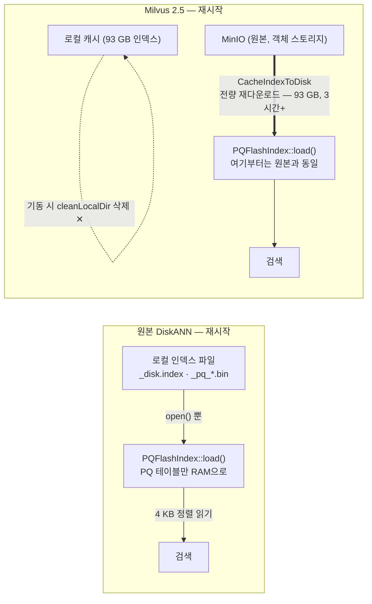

# "재시작하면 DiskANN 인덱스를 다시 받는다" — 원리인가, Milvus인가, 환각인가

> 2026-08-06 · 검증 기준: milvus v2.5.27 · knowhere 2.5 · microsoft/DiskANN cpp_main@78256bb

"Milvus는 로컬 DiskANN 인덱스를 재시작 후 재사용하지 못한다(재시작 1회 = 로드 3시간)"는
주장을 원본 소스코드와 공개 자료만으로 재검증한 문서다. 모든 진술에 출처 번호가 붙어
있고, 출처 없이 쓴 문장은 [7절](#7-어디까지가-코드이고-어디부터가-추론인가)에 따로 모아
추론임을 명시했다.

---

## 1. 한눈 판정

| 질문 | 판정 | 근거 |
|---|---|---|
| 원리적으로 안 되는 것인가? | **아니오** | 원본 Microsoft DiskANN은 인덱스 재사용이 기본 동작이다. 인덱스는 평범한 로컬 파일 묶음이고, 검색 프로세스는 그 파일을 `open(O_DIRECT)`으로 열기만 한다. 재시작 = 파일 다시 열기다 [5][6][8] |
| Milvus만 안 되는 것인가? | **예** | Milvus는 로컬 디스크를 저장소가 아니라 **버려도 되는 캐시**로 취급한다. 기동 시 무조건 삭제하고(`cleanLocalDir`), 로드 시 로컬 존재를 확인하지 않고 MinIO에서 다시 받는다(`CacheIndexToDisk`). 두 동작 모두 끄는 설정이 없다 [1][2][3]. 메인테이너도 재시작 시 S3/MinIO에서 다시 읽는 것이 정상 동작이라고 공식 답변했다 [12] |
| 환각이었나? | **아니오** | 주장 3줄 전부 v2.5.27 소스에서 함수 단위로 재확인됐고, 기동 시 삭제는 85 GB 실측으로도 확인돼 있다 [11]. 단, "체크섬이 없어서 신뢰하지 않는 설계"라는 **의도 서술은 코드에서 유추한 추론**이다 — 7절에 분리했다 |

요약하면: **같은 엔진, 다른 껍데기**다. Milvus가 내부에서 쓰는 DiskANN 엔진(Knowhere의
`PQFlashIndex`)은 원본과 동일하게 로컬 파일에서 로드한다 [4]. 재사용을 막는 것은 엔진이
아니라 그 위에 Milvus가 얹은 "객체 스토리지가 원본, 로컬은 캐시"라는 아키텍처 계층이다.

## 2. 검증 대상 — 원 주장

1. **저장은 된다** — 인덱스 파일은 HDD에 남는다. 문제는 Milvus가 그것을 읽어주느냐다.
2. **기동 때 지운다** — `cmd/roles/roles.go`의 `cleanLocalDir`이 로컬 디렉터리를 조건
   없이 `os.RemoveAll` 하고, 끄는 설정·환경변수가 없다.
3. **되돌려놔도 안 읽는다** — `VectorDiskIndex::Load()`가 로컬 파일 존재를 확인하지
   않고 MinIO에서 다시 받아 덮어쓴다. 그래서 재시작 1회 = 로드 3시간 12분.

아래 3~4절이 이 세 문장을 각각 코드에 대응시킨다.

## 3. Milvus 쪽 증거 사슬 — 삭제하고, 다시 받는다

### 3.1 기동 시 무조건 삭제 — `cleanLocalDir` `[코드 확인]`

QueryNode와 IndexNode의 기동 함수가 로컬 스토리지 루트(`{root}/querynode`,
`{root}/indexnode`)와 mmap 디렉터리를 조건 없이 지운다. `os.RemoveAll`을 감싸는 설정
플래그는 없다.

```go
func cleanLocalDir(path string) {
    _, statErr := os.Stat(path)
    ...
    // path exist, remove all
    if statErr == nil {
        err := os.RemoveAll(path)   // 조건 없음
        ...
        log.Info("Clean local data cache", zap.String("path", path))
    }
}

// runQueryNode 내부
queryDataLocalPath := filepath.Join(rootPath, typeutil.QueryNodeRole)
cleanLocalDir(queryDataLocalPath)
```

— milvus v2.5.27 · cmd/roles/roles.go [1]

### 3.2 로드 경로도 로컬을 지우고 시작 — `VectorDiskAnnIndex` 생성자 `[코드 확인]`

세그먼트 인덱스를 로드할 때 만들어지는 C++ 객체의 생성자가, 해당 인덱스의 로컬 경로가
이미 있으면 지우고 새로 만든다. 즉 3.1을 우회해 파일을 살려 둬도 여기서 한 번 더
지워진다.

```cpp
if (local_chunk_manager->Exist(local_index_path_prefix)) {
    local_chunk_manager->RemoveDir(local_index_path_prefix);
}
local_chunk_manager->CreateDir(local_index_path_prefix);
```

— milvus v2.5.27 · internal/core/src/index/VectorDiskIndex.cpp [2]

### 3.3 로드는 존재 검사 없이 원격 다운로드 — `Load()` → `CacheIndexToDisk()` `[코드 확인]`

`Load()`는 로컬 파일이 이미 있는지 보지 않고 무조건 `CacheIndexToDisk()`를 부르고, 그
구현은 원격 청크 매니저(`rcm_` = MinIO/S3)에서 `GetObjectData`로 받아 로컬에 쓴다.
다운로드 전 로컬 존재 검사는 어디에도 없다.

```cpp
// VectorDiskAnnIndex<T>::Load — 존재 검사 없음
auto index_files = GetValueFromConfig<std::vector<std::string>>(
    config, "index_files");
file_manager_->CacheIndexToDisk(index_files.value());

// DiskFileManagerImpl — 원격에서 읽어 로컬에 쓴다
GetObjectData(rcm_.get(), batch_remote_files);   // rcm_ = remote(MinIO)
file_writer.Write(chunk_codec->PayloadData(), ...);
```

— milvus v2.5.27 · internal/core/src/index/VectorDiskIndex.cpp ·
internal/core/src/storage/DiskFileManagerImpl.cpp [2][3]

### 3.4 그 아래 엔진은 로컬 파일만 안다 — Knowhere `Deserialize` `[코드 확인]`

다운로드가 끝나면 Knowhere의 DiskANN 인덱스 노드가 `index_prefix`(로컬 경로)에서 파일을
열어 원본 DiskANN과 동일한 `PQFlashIndex::load()`를 부른다. 이 계층에는 네트워크 코드가
없다 — **재다운로드는 엔진의 요구가 아니라 Milvus 계층의 결정**이라는 근거다.

```cpp
index_prefix_ = prep_conf.index_prefix.value();
...
pq_flash_index_ = std::make_unique<diskann::PQFlashIndex<DataType>>(
    reader, diskann_metric);
int res = pq_flash_index_->load(search_pool_->size(),
                                index_prefix_.c_str());   // 로컬 경로
```

— knowhere 2.5 · src/index/diskann/diskann.cc [4]

### 3.5 실측 — 되살려 놓은 85 GB를 그대로 지웠다 `[실측 확인]`

2026-08-05, 기동 전에 로컬 인덱스 `data/indexnode`(85 GB, 202 세그먼트)를 `mv`로
빼뒀다가 기동 직전 되돌려 놓는 실험을 했다. Milvus는 복원된 85 GB를 그대로 삭제했다
(볼륨 523 → 435 GiB). 3.1의 실측 확인이다. 완주한 재로드는 3시간 12분(11,527.9 s)이
측정돼 있다. — [DEVLOG](./DEVLOG.md) "로컬 인덱스는 남길 수 없다" 절 [11]

## 4. 원본 DiskANN — 재사용이 기본값이다

Microsoft의 원본 라이브러리에서 인덱스 빌드와 검색은 **별도의 실행 파일**이고, 둘이
공유하는 것은 파일 경로 prefix뿐이다. `build_disk_index`가 `~/index_test_disk.index`,
`~/index_test_pq_pivots.bin`, `~/index_test_pq_compressed.bin` 등 8~10개의 파일을 쓰고,
`search_disk_index`는 같은 prefix를 받아 그 파일을 열 뿐이다 [5]. 공식 워크플로 문서의
표현:

> "While serving the index, the entire graph is stored on SSD."
> — *workflows/SSD_index.md* [5]

### 4.1 로드 = 파일 열기 — `PQFlashIndex::load()` `[코드 확인]`

RAM으로 올라가는 것은 PQ 압축 벡터와 피벗 테이블(작다)뿐이고, 그래프와 원본 벡터가 든
`_disk.index`는 *열기만* 한다. 검색 시 4 KB 정렬 섹터 읽기로 필요한 노드만 읽는다.

```cpp
int PQFlashIndex<T, LabelT>::load(uint32_t num_threads,
                                  const char *index_prefix) {
    std::string pq_table_bin          = prefix + "_pq_pivots.bin";
    std::string pq_compressed_vectors = prefix + "_pq_compressed.bin";
    std::string _disk_index_file      = prefix + "_disk.index";
    ...
}
// load_from_separate_paths 내부
diskann::load_bin<uint8_t>(pq_compressed_vectors, this->data, ...);  // RAM
_pq_table.load_pq_centroid_bin(pq_table_bin.c_str(), ...);           // RAM
reader->open(index_fname);        // 그래프 파일은 '열기'만 — 로드 아님
```

— microsoft/DiskANN cpp_main · src/pq_flash_index.cpp L761–1102 [6]

### 4.2 파일은 POSIX `open()`으로 — 네트워크 코드 0건 `[코드 확인]`

```cpp
void LinuxAlignedFileReader::open(const std::string &fname) {
    int flags = O_DIRECT | O_RDONLY | O_LARGEFILE;
    this->file_desc = ::open(fname.c_str(), flags);
```

cpp_main 브랜치 전체 파일 트리(281개)를 스캔한 결과 s3 · blob · azure · download ·
http에 해당하는 경로·심벌이 **0건**이다. 파일 리더 구현은
`linux_aligned_file_reader.cpp`와 `windows_aligned_file_reader.cpp` 둘뿐 — 객체
스토리지에서 받아오는 단계 자체가 존재하지 않는다. [8]

### 4.3 논문의 설계 그 자체다 `[원문 인용]`

NeurIPS 2019 논문(§3.2): *"We store the compressed vectors of all the data points in
memory, and store the graph along with the full-precision vectors on the SSD."* —
디스크 위 인덱스는 일회용 산출물이 아니라 **서빙의 주체**다. 검색은 압축 벡터로 방향을
잡고 SSD에서 필요한 이웃 목록만 읽는다(§3.3) [10]. Zilliz(Milvus 개발사) 공식 블로그의
소개도 같다 — "persisting the bulk of the index on NVMe hard disks" [22].

> **정직한 각주 둘.** ① README에 "재시작 후 재사용 가능"이라는 명문장은 없다 —
> 빌드/검색이 파일만 공유하는 별도 프로세스이고 로드 경로가 읽기 전용이라는 *구조*에서
> 따라 나오는 결론이다. ② 현재 microsoft/DiskANN의 `main` 브랜치는 재작성판(DiskANN3)
> 이라 위 코드가 없다. 인용은 전부 클래식 C++ 구현이 있는 `cpp_main` 브랜치(커밋
> 78256bb) 기준이다.

## 5. 재시작 경로 비교 — 어디에 단계가 끼어드는가



두 경로의 끝은 같은 함수(`PQFlashIndex::load`)다. 차이는 Milvus가 그 앞에 붙인 두 단계
— 기동 시 로컬 캐시 삭제와 MinIO 전량 재다운로드 — 이며, 둘 다 설정으로 끌 수 없다.

## 6. 공개 출처 대조 — 우리만 겪은 일이 아니다

3절의 동작이 우리 환경(USB HDD, 비지원 구성)의 특수 사례가 아니라 Milvus의 공식적·
일반적 동작인지, GitHub 이슈·공식 문서·메인테이너 발언으로 교차 확인했다.

### 6.1 메인테이너가 직접 설명한다

> "When you call collection.load(), the query nodes read the index files from
> S3/minio … If the milvus is crash/restarted, the query nodes automatically load
> the collection … The data files and index files are always there, on the
> S3/minio."
> — yhmo (Milvus 메인테이너), Discussion #36866 "Questions about data persistence" [12]

설계 목표도 공식 발언으로 남아 있다: *"The design goal for milvus is to become
stateless, so we can scale fast"* (xiaofan-luan, 메인테이너) [13]. 공식 아키텍처 문서도
같은 말을 한다 — 워커 노드는 저장·계산 분리 덕에 무상태(stateless)이고, 벡터·스칼라
인덱스 파일의 저장처는 객체 스토리지다 [18].

### 6.2 같은 지점을 겪은 제3자 보고

| 이슈 | 내용 |
|---|---|
| [#48116](https://github.com/milvus-io/milvus/issues/48116) (2026-03) | 기동 시 `cleanLocalDir`(roles.go:103)이 로컬 캐시를 지우다 NFS 잔여 파일에서 panic — **삭제 메커니즘을 함수명까지 지목한 제3자 버그 리포트** [14] |
| [#48792](https://github.com/milvus-io/milvus/issues/48792) (2026-04) | DiskANN 파일(`_disk.index`, `_cached_nodes.bin`)이 로컬 *캐시* 경로에 있고 release 시 `RemoveDir`로 삭제되는 호출 사슬이 로그로 노출 [15] |
| [#45178](https://github.com/milvus-io/milvus/issues/45178) (2025-10) | "인덱스는 객체 스토리지에서 **모든** query node의 로컬 SSD로 다운로드된 뒤에야 서빙된다"를 현행 동작으로 전제하고, 기동 지연을 이유로 Shared Hot Storage를 요청. 메인테이너는 미래의 NCS 설계로 응답 — 즉 아직 없는 기능 [16] |
| [#21866](https://github.com/milvus-io/milvus/issues/21866) (2023-01) | 로컬 디스크 캐시라는 개념 자체가 메인테이너의 feature request였다 — 그 이전의 "로드"는 전부 메모리 적재였다 [17] |

### 6.3 최신 2.6도 "재사용"이 아니라 "지연 다운로드"다

Milvus 2.6의 tiered storage는 로드 방식을 크게 바꿨다 — "QueryNode caches metadata
only. Field data is pulled on demand", "Index files remain remote until the first
query needs them", LRU 축출 [19]. 그러나 이것은 다운로드의 **시점을 늦추고 단위를 잘게
만든 것**이지, 재시작 후 로컬 파일을 다시 쓰는 것이 아니다. 재시작 후 로컬 인덱스
재사용을 명시한 공개 문서·릴리스 노트는 **어느 버전에도 없다**. 부정 소견도 기록해
둔다: GitHub 이슈를 10여 개 질의로 검색했지만 "재시작 후 로컬 인덱스를 재사용해 달라"는
이슈 자체를 찾지 못했다 — 가장 가까운 것이 위의 #45178이다.

### 6.4 반대편 대조군 — 로컬 디스크가 원본인 DB들

같은 "디스크 위 인덱스"라도 로컬 디스크를 *원본 저장소*로 쓰는 DB는 재시작 시 당연히
재사용한다. Qdrant는 "Qdrant always stores vectors in a memory-mapped file on disk"
[20], Weaviate는 WAL 재생과 스냅숏으로 재시작 시 인덱스를 복원한다("if a valid snapshot
exists, it will be loaded into memory first") [21]. 재사용 불가는 벡터 DB 일반의 성질이
아니라, **객체 스토리지를 원본으로 삼은 아키텍처의 성질**이다.

## 7. 어디까지가 코드이고, 어디부터가 추론인가

| 진술 | 등급 | 근거 |
|---|---|---|
| 기동 시 로컬 인덱스를 조건 없이 삭제한다 | 코드 + 실측 | `cleanLocalDir` [1] + 85 GB 삭제 실측 [11] |
| 로드는 로컬 존재를 확인하지 않고 재다운로드한다 | 코드 | `Load()` → `CacheIndexToDisk`, 존재 검사 부재 [2][3]. 단 이 항목의 단독 실측은 실패해서 없다(실험이 3.5에서 중단됨 [11]) |
| DiskANN 원리상으로는 재사용이 기본이다 | 코드 + 문서 | `PQFlashIndex::load` 읽기 전용 경로 [6], 워크플로 문서 [5], 논문 §3.2 [10] |
| "로컬 디스크는 소모품 캐시이고 원본은 객체 스토리지"라는 설계 | 공식 발언 | 메인테이너 발언 [12][13], 아키텍처 문서의 stateless 워커 [18] |
| "체크섬이 없어 잘린 파일을 판별 못 하므로 신뢰하지 않는 것"이라는 이유 서술 | **추론** | 코드에 검증 로직이 없다는 사실에서 유추한 설계 *이유*. 이 문장만은 공식 출처를 확보하지 못했다 |
| 재시작 세금 = 3시간 12분 | 실측 | 완주 로드 11,527.9 s (08-05 22:51 → 08-06 02:03, VM 18 GB, virtiofs) [11]. 이 환경(USB HDD + Docker 파일공유)의 값이며 일반화 불가 |

## 8. 출처

**Milvus (v2.5.27 태그 고정)**

1. [cmd/roles/roles.go](https://github.com/milvus-io/milvus/blob/v2.5.27/cmd/roles/roles.go) — `cleanLocalDir` 정의와 QueryNode/IndexNode 기동부 호출 지점
2. [internal/core/src/index/VectorDiskIndex.cpp](https://github.com/milvus-io/milvus/blob/v2.5.27/internal/core/src/index/VectorDiskIndex.cpp) — 생성자의 `RemoveDir`, `Load()`의 무조건 `CacheIndexToDisk`
3. [internal/core/src/storage/DiskFileManagerImpl.cpp](https://github.com/milvus-io/milvus/blob/v2.5.27/internal/core/src/storage/DiskFileManagerImpl.cpp) — `CacheIndexToDisk`: 원격 `GetObjectData` → 로컬 쓰기, 존재 검사 없음
4. [zilliztech/knowhere (2.5) · src/index/diskann/diskann.cc](https://github.com/zilliztech/knowhere/blob/2.5/src/index/diskann/diskann.cc) — `Deserialize`가 로컬 `index_prefix`에서 `PQFlashIndex::load` 호출, 네트워크 코드 없음

**Microsoft DiskANN (cpp_main 브랜치 · 커밋 78256bb)**

5. [workflows/SSD_index.md](https://github.com/microsoft/DiskANN/blob/cpp_main/workflows/SSD_index.md) — 빌드/검색이 prefix 파일만 공유; "While serving the index, the entire graph is stored on SSD"
6. [src/pq_flash_index.cpp](https://github.com/microsoft/DiskANN/blob/78256bbab4685e1774e78d331e081a153be26823/src/pq_flash_index.cpp) — `load()` L761–773, PQ만 RAM 로드, `reader->open()` L1100–1102, 검색 시 섹터 읽기 L1431–1477
7. [apps/search_disk_index.cpp](https://github.com/microsoft/DiskANN/blob/78256bbab4685e1774e78d331e081a153be26823/apps/search_disk_index.cpp) — 검색 실행 파일의 기동 순서: `load()` 후 RAM 노드 캐시를 매번 새로 구축
8. [src/linux_aligned_file_reader.cpp](https://github.com/microsoft/DiskANN/blob/78256bbab4685e1774e78d331e081a153be26823/src/linux_aligned_file_reader.cpp) — `open(O_DIRECT | O_RDONLY)`; 트리 281개 파일에 객체 스토리지 경로 0건
9. [include/pq_flash_index.h](https://github.com/microsoft/DiskANN/blob/78256bbab4685e1774e78d331e081a153be26823/include/pq_flash_index.h) — "load compressed data, and obtains the handle to the disk-resident index"
10. [DiskANN: Fast Accurate Billion-point Nearest Neighbor Search on a Single Node](https://papers.nips.cc/paper_files/paper/2019/hash/09853c7fb1d3f8ee67a61b6bf4a7f8e6-Abstract.html) (NeurIPS 2019) — §3.2 인덱스 레이아웃, §3.3 빔 서치

**내부 기록**

11. [DEVLOG.md](./DEVLOG.md) — "로컬 인덱스는 남길 수 없다" 절: 85 GB 복원-삭제 실측(08-05), 완주 로드 3시간 12분(08-06)

**Milvus 공개 논의 · 문서**

12. [Discussion #36866 — Questions about data persistence](https://github.com/milvus-io/milvus/discussions/36866) — 메인테이너 yhmo: 로드·재시작 시 query node가 S3/MinIO에서 인덱스 파일을 읽는다
13. [Discussion #20095 — Where is data stored](https://github.com/milvus-io/milvus/discussions/20095) — MinIO/S3가 "the major data storage"; xiaofan-luan: "The design goal for milvus is to become stateless"
14. [Issue #48116](https://github.com/milvus-io/milvus/issues/48116) — `cleanLocalDir`(cmd/roles/roles.go:103)의 기동 시 로컬 캐시 삭제가 NFS에서 panic (v2.5.15 기준 동작 확인)
15. [Issue #48792](https://github.com/milvus-io/milvus/issues/48792) — 로컬 캐시 경로의 `_disk.index`를 `LocalChunkManager::RemoveDir`로 삭제하는 호출 사슬
16. [Issue #45178 — \[Feature\]: Shared Hot Storage for Milvus](https://github.com/milvus-io/milvus/issues/45178) — 노드별 재다운로드를 현행 동작으로 전제한 개선 요청 (open)
17. [Issue #21866 — \[Feature\]: Support local disk caching and Mmap data](https://github.com/milvus-io/milvus/issues/21866) — 로컬 디스크 캐시의 원 제안 (2023, open)
18. [Architecture Overview](https://milvus.io/docs/architecture_overview.md) · [Four Layers](https://milvus.io/docs/four_layers.md) — "Worker nodes are stateless"; 객체 스토리지가 "index files for scalar and vector data" 저장
19. [Tiered Storage Overview (2.6.4+)](https://milvus.io/docs/tiered-storage-overview.md) · [공식 블로그: Milvus Tiered Storage](https://milvus.io/blog/milvus-tiered-storage-80-less-vector-search-cost-with-on-demand-hot%E2%80%93cold-data-loading.md) — 온디맨드 로딩·LRU 축출; 재시작 후 로컬 재사용 언급 없음

**대조군 · 보충**

20. [Qdrant docs — Storage](https://qdrant.tech/documentation/concepts/storage/) — 로컬 memory-mapped 파일이 원본 저장소
21. [Weaviate docs — Storage](https://docs.weaviate.io/weaviate/concepts/storage) — WAL + 스냅숏으로 재시작 시 인덱스 복원
22. [Zilliz — DiskANN and the Vamana Algorithm](https://zilliz.com/learn/DiskANN-and-the-Vamana-Algorithm) — "persisting the bulk of the index on NVMe hard disks"
